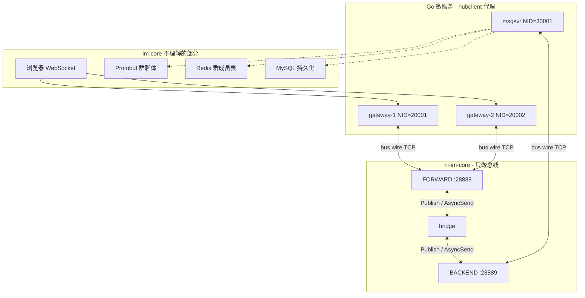
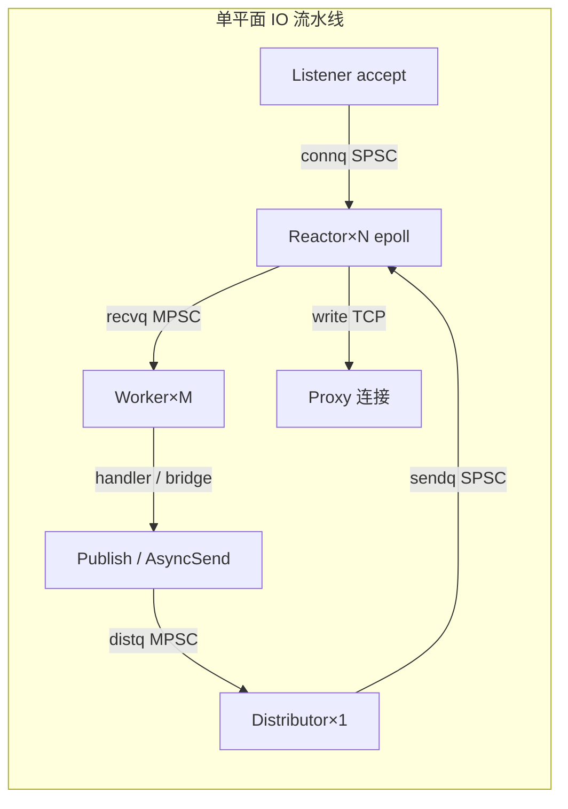
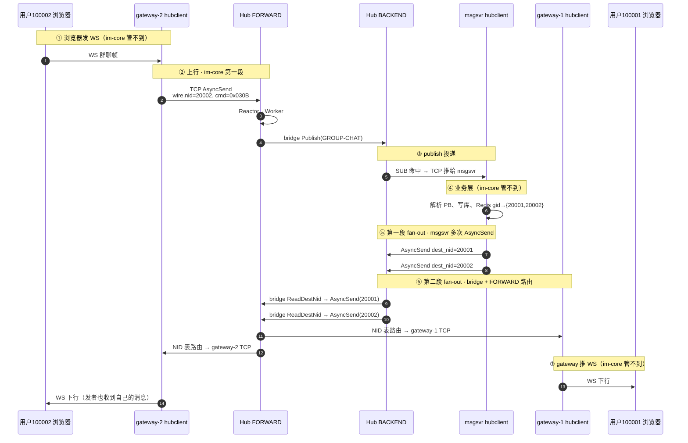

# hi-im-core 核心流程与双端群聊串联

> **用途**：理解 im-core 在 hi-im 生态中的角色、内部流水线、双端群聊上下行流转，以及单独重放测试 im-core 的方式。  
> **关联**：[技术设计文档.md](../技术设计文档.md)、[协议规范-bus-wire-v1.md](../协议规范-bus-wire-v1.md)、[theme/06-群聊端到端背诵.md](../theme/06-群聊端到端背诵.md)

---

## 1. hi-im-core 在此案例中扮演什么角色



| 层级 | 组件 | 职责 |
|------|------|------|
| **接入** | gateway + hubclient | WS ↔ IM 帧封装；连 **FORWARD** |
| **总线** | **hi-im-core** | 按 **cmd** 广播（publish）、按 **NID** 单播（async_send）；双平面 bridge |
| **业务** | msgsvr + hubclient | SUB 群聊 cmd；查 Redis fan-out；连 **BACKEND** |

im-core 的边界写得很清楚：**不解析 Protobuf、不查 Redis、不持久化**——它只搬运 opaque payload，bridge 下行时最多读 IM 头里的 `dest_nid`（offset 24）。

---

## 2. im-core 内部核心流程图

每个平面（FORWARD / BACKEND）各有一套完整流水线：



**两条路由规则**（`src/hub/bridge.cpp`）：

```text
FORWARD 收到上行业务帧  →  peer.Publish(cmd, payload)      → BACKEND SUB 表
BACKEND 收到下行业务帧  →  ReadDestNid(payload)             → peer.AsyncSend(dest_nid)
```

---

## 3. 双端群聊案例：100002 在 gateway-2 发一条群消息

### 3.1 部署拓扑（M6）

```text
uid=100001  ──► gateway-1  NID=20001  ws :28080  ──┐
uid=100002  ──► gateway-2  NID=20002  ws :28081  ──┼──► Hub FORWARD :28888
                                                    │
msgsvr      NID=30001                             ──┼──► Hub BACKEND  :28889
```

### 3.2 全链路时序（从 100002 发群聊出发）



### 3.3 双段 fan-out（面试白板必画）

```text
┌──────────────────────────────────────────────────────────┐
│ 第一段 · 业务层（msgsvr @ BACKEND）                        │
│   gid → Redis → {gateway NID: 20001, 20002}              │
│   for nid in members: hubclient.AsyncSend(nid, payload)  │
├──────────────────────────────────────────────────────────┤
│ 第二段 · 总线层（bridge @ Hub）                            │
│   BACKEND 收到 payload 内 IM.dest_nid                    │
│   → FORWARD AsyncSend(dest_nid) → 各 gateway TCP 连接     │
└──────────────────────────────────────────────────────────┘
```

| 段 | 路由键 | 查什么表 |
|----|--------|----------|
| 第一段出口 | 成员 **gateway NID** | msgsvr 内存/Redis 群成员 |
| 第二段 | **gateway NID** | Hub Router `nid→连接` |

---

## 4. 每一跳的入参 / 出参（可重放测试）

im-core 的「API」就是 **TCP 上的 bus wire 帧**。两层头要分开看：

### 4.1 帧结构

```text
┌─────────────────────────────────────────────────────────┐
│ WireHeader 20B（Hub 认这个）                              │
│   type=cmd, nid, flag(0=SYS/1=EXP), length, chksum      │
├─────────────────────────────────────────────────────────┤
│ Payload = IM MesgHeader 52B + body（Hub 当 opaque）     │
│   offset 24 = dest_nid  ← bridge 下行路由键               │
│   offset 28 = seq        ← 日志追踪                       │
└─────────────────────────────────────────────────────────┘
```

### 4.2 连接建立（所有代理必须先做）

| 步骤 | 连接 | 入参 | 出参 |
|------|------|------|------|
| AUTH | Proxy → Hub | `AUTH_REQ`: gid, user[32], pass[16], **nid** | `AUTH_ACK` |
| SUB | msgsvr → BACKEND | `SUB_REQ` payload = cmd_be(`0x030B`) | `SUB_ACK` |

gateway **只 AUTH，不 SUB** 业务 cmd；msgsvr **AUTH + SUB(0x030B)**。

默认鉴权：`user=proxy`, `pass=proxy`（见 `HubConfig`）。

### 4.3 上行：100002 → gateway-2 → FORWARD → msgsvr

**模拟 gateway-2 hubclient 发一帧到 `:28888`：**

| 字段 | 值 | 说明 |
|------|-----|------|
| Wire.type | `0x030B` | GROUP-CHAT |
| Wire.nid | `20002` | **发送方 gateway 的 NID**（不是 uid） |
| Wire.flag | `1` (EXP) | 业务帧 |
| Payload | IM 52B + body | body 可以是任意 bytes；Hub 不解析 |

**im-core 内部变换：**

```text
入: FORWARD TCP 帧 (wire.nid=20002)
出: BACKEND TCP 帧推给 msgsvr (wire.nid=30001, payload 不变)
     机制: bridge → Publish → SUB 表
```

参考集成测试 `test/integration/hub_proxy_test.cpp` 的上行段：

```cpp
std::vector<uint8_t> im_payload(48, 0);
const uint32_t type_be = HostToBe32(cmd);
const uint32_t dest_be = HostToBe32(30001);
std::memcpy(im_payload.data(), &type_be, sizeof(type_be));
std::memcpy(im_payload.data() + 4, &dest_be, sizeof(dest_be));

const auto biz = EncodeFrame(cmd, 20001, kFlagExp, im_payload);
WriteAll(forward_fd, biz);
// 期望 backend_fd 收到 cmd=0x030B 的帧
```

### 4.4 下行：msgsvr fan-out → BACKEND → FORWARD → gateway

**模拟 msgsvr hubclient 发一帧到 `:28889`（给 100001 / gateway-1）：**

| 字段 | 值 | 说明 |
|------|-----|------|
| Wire.type | `0x030B` | |
| Wire.nid | `30001` | **msgsvr 自己的 NID** |
| Wire.flag | `1` | |
| IM.cmd | `0x030B` | |
| IM.sid | `100002` | 源用户 session |
| IM.dest_nid | **`20001`** | **目标 gateway NID**（bridge 读这个） |
| IM.seq | 单调递增 | |
| body | `"hello from 100002"` | 任意 bytes |

仓库里可直接复用的编码方式（`test/bridge_downlink_test.cpp`）：

```cpp
bool SendBackendDownlink(int backend_fd, uint32_t dest_nid, uint64_t seq,
                         std::string_view text) {
  const std::vector<uint8_t> body(text.begin(), text.end());
  const auto im_payload =
      hiim::im::PackPayload(0x030B, 100001, dest_nid, seq, body);
  const auto wire =
      EncodeFrame(0x030B, 31001, kFlagExp, im_payload);
  return WriteAll(backend_fd, wire);
}
```

**im-core 内部变换：**

```text
入: BACKEND TCP 帧 (payload.IM.dest_nid=20001)
    bridge ReadDestNid → peer.AsyncSend(20001)
出: FORWARD TCP 帧 (wire.nid=20001, payload 不变) → gateway-1 连接
```

给 100002 自己（gateway-2）再发一帧，`dest_nid=20002` 即可。

---

## 5. 单独测 im-core：你要模拟什么

```text
不能：浏览器 WS 直接打 im-core
可以：用 TCP 模拟 N 个 hubclient 代理，按 bus wire v1 发二进制帧
```

### 5.1 最小测试拓扑（4 条 TCP）

| 模拟角色 | 连哪个端口 | AUTH nid | 还要做什么 |
|----------|-----------|----------|-----------|
| gateway-1 | FORWARD `:28888` | 20001 | 监听下行帧 |
| gateway-2 | FORWARD `:28888` | 20002 | **发上行** + 监听下行 |
| msgsvr | BACKEND `:28889` | 30001 | **SUB(0x030B)** + 收 publish |

### 5.2 能测 / 不能测

| 范围 | im-core 单测 | 需要 Go 微服务 |
|------|-------------|---------------|
| bridge 上行 FORWARD→BACKEND publish | ✅ | |
| bridge 下行 BACKEND→FORWARD 按 dest_nid 路由 | ✅ | |
| 双 gateway 各收各的、不串包 | ✅ `bridge_downlink_test` | |
| Redis 查群成员 | ❌ | msgsvr |
| Protobuf 编解码 | ❌ | gateway / msgsvr |
| 浏览器 WS | ❌ | gateway |

**测「100002 发群聊 → 100001 收到」在 im-core 层要拆成两步：**

1. **上行段**：gateway-2 模拟帧 → FORWARD → 断言 msgsvr 连接收到 publish（`hub_proxy_test` 模式）
2. **下行段**：你**手工**模拟 msgsvr fan-out，向 BACKEND 发 `dest_nid=20001` 和 `20002` 两帧 → 断言 gateway-1/2 各收到（`bridge_downlink_test` 模式）

im-core **不会**因为你在 FORWARD 发了一条上行，就自动 fan-out 到两个 gateway——**fan-out 是 msgsvr 的业务逻辑**，Hub 只负责按 NID 投递。

---

## 6. 验证命令

```bash
# 启动 Hub
./build/hi-im-hub \
  --forward-listen 0.0.0.0:28888 \
  --backend-listen 0.0.0.0:28889

# 跑 im-core 自带的集成/bridge 单测（就是「模拟 hubclient 发 TCP 帧」）
ctest --test-dir build --output-on-failure -R 'bridge_downlink|hub_proxy'
```

全栈双端群聊（含 msgsvr Redis fan-out）在 hi-im 主仓库：

```bash
cd examples/smoke-group
HIIM_GATEWAY_A_WS=ws://127.0.0.1:28080/ws \
HIIM_GATEWAY_B_WS=ws://127.0.0.1:28081/ws \
go run . -burst 5
```

---

## 7. 一句话总结

- **im-core = 双平面 TCP 总线**：上行 publish（按 cmd），下行 async_send（按 NID），中间 bridge 做 FORWARD↔BACKEND 转发。
- **100002 发群聊**：浏览器段在 gateway；im-core 只处理 gateway-2→FORWARD 上行 和 msgsvr→BACKEND→FORWARD→gateway 下行两段。
- **单独重放测试**：模拟 **gateway hubclient + msgsvr hubclient** 四条 TCP，按 `EncodeAuthFrame` / `EncodeFrame` / `PackPayload` 发二进制帧即可；**msgsvr 的 Redis fan-out 需要你手动发两帧 AsyncSend**，im-core 不会替你完成。

---

## 8. 源码与文档索引

| 内容 | 位置 |
|------|------|
| bridge 两条规则 | `src/hub/bridge.cpp` |
| Publish / AsyncSend | `src/hub/context_impl.cpp` |
| Router SUB / NID 表 | `src/hub/router.cpp` |
| IM dest_nid 读取 | `include/hiim/im/header.hpp` |
| 上行集成测试 | `test/integration/hub_proxy_test.cpp` |
| 下行 bridge 测试 | `test/bridge_downlink_test.cpp` |
| 双平面专题 | [theme/04-双平面FORWARD与BACKEND.md](../theme/04-双平面FORWARD与BACKEND.md) |
| publish/async_send 专题 | [theme/05-async_send与publish路由.md](../theme/05-async_send与publish路由.md) |
| 群聊端到端 | [theme/06-群聊端到端背诵.md](../theme/06-群聊端到端背诵.md) |
| 跟一条消息读代码 | [跟一条消息读代码.md](./跟一条消息读代码.md) |
