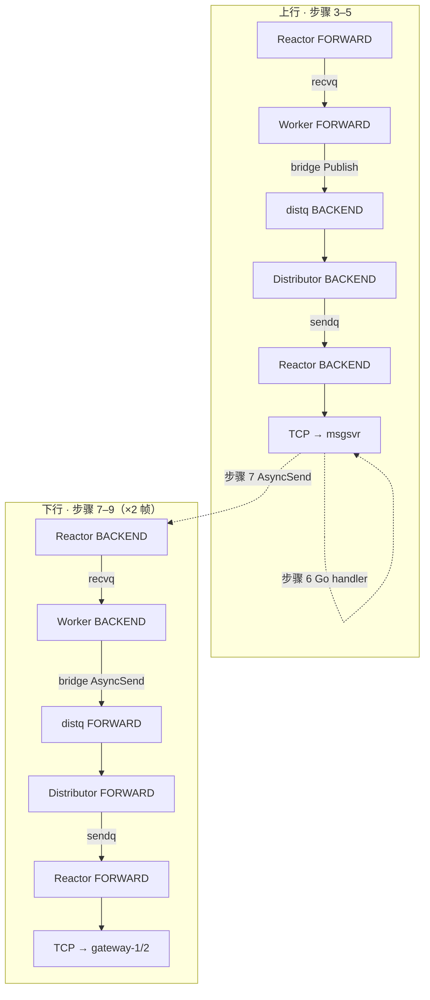

# 群聊故事线串 hi-im 核心业务 + hi-im-core 线程模型

> **用途**：用一条双端群聊消息（甲发 `hi,friend!` → 乙收到）当主线，把 **hi-im 热路径业务** 与 **hi-im-core 四角色四队列** 焊在一起，再按锚点精读 C++ 源码。  
> **前置**：[群聊的订阅关系梳理.md](./群聊的订阅关系梳理.md) §5（11 步全链路、订阅关系）  
> **配套**：[跟一条消息读代码.md](./跟一条消息读代码.md)、[源码注释导读.md](./源码注释导读.md)

---

## 1. 怎么用这份文档（推荐路径）

```text
第 0 步  读「群聊的订阅关系梳理」§5 — 11 步故事 + 订阅四层
第 1 步  读本文 §2～§4 — 故事线 ↔ 线程模型 ↔ 源码锚点（建立框架）
第 2 步  按本文 §6 精读 5 个核心 .cpp（对着故事问：步骤几用到？）
第 3 步  跑 bridge_downlink_test / hub_proxy_test — 可执行验证
第 4 步  按需补 queue.hpp、listener、health、bench（剩下 ~10%）
```

**目标**：先掌握 **思路框架（~90%）**，再抠 **每一行 C++（~100% hi-im-core）**。

---

## 2. 故事线：11 步全链路（与订阅文档一致）

**拓扑**：甲 uid=100001 @ gateway-1 NID=20001；乙 uid=100002 @ gateway-2 NID=20002；msgsvr NID=30001。

| 步骤 | 谁 | 做什么 |
|------|-----|--------|
| **1** | 甲浏览器 | WS 发群聊 `"hi,friend!"` |
| **2** | gateway-1 | hubclient 上行（wire cmd=0x030B） |
| **3** | Hub FORWARD | Reactor 拼帧 → recvq → Worker |
| **4** | bridge（FORWARD） | `peer.Publish(0x030B)` → BACKEND |
| **5** | Hub BACKEND | 查 SUB 表 → publish 推到 msgsvr TCP |
| **6** | msgsvr handler | 解析 PB、写库、Redis 查成员 NID |
| **7** | msgsvr | `AsyncSend(20001)` + `AsyncSend(20002)` |
| **8** | bridge（BACKEND） | `ReadDestNid` → FORWARD AsyncSend ×2 |
| **9** | Hub FORWARD | NID 表路由 → TCP 下行 gateway-1/2 |
| **10** | gateway-1 | WS → 甲（发者回显） |
| **11** | gateway-2 | WS → 乙（接收者） |

完整时序图见 [群聊的订阅关系梳理.md §5](./群聊的订阅关系梳理.md#5-甲发hifriend--乙收到完整全链路)。

---

## 3. 故事线落在哪：hi-im 全栈 vs hi-im-core 边界

```text
┌─────────────────────────────────────────────────────────────────┐
│ hi-im 全栈（本文故事 11 步）                                      │
├─────────────────────────────────────────────────────────────────┤
│ 步骤 1,2,6,10,11  →  gateway / msgsvr / 浏览器 / Redis / DB   │
│                     （Go 业务，hi-im-core 不解析、不持久化）       │
├─────────────────────────────────────────────────────────────────┤
│ 步骤 3,4,5,7,8,9  →  hi-im-core（C++ Hub 双平面 + 四角色）       │
│                     ← 本文重点，走两遍「recvq→distq→sendq」     │
└─────────────────────────────────────────────────────────────────┘
```

| 步骤 | hi-im 核心业务 | hi-im-core |
|------|----------------|------------|
| 1–2 | gateway 封装 IM 帧、WS↔hubclient | FORWARD Reactor 收 TCP |
| 3–5 | — | 上行流水线 + bridge Publish + SUB 表 |
| 6 | msgsvr handler、Redis 群成员 | — |
| 7–9 | msgsvr fan-out AsyncSend | 下行流水线 + bridge + NID 表 |
| 10–11 | gateway WS 推送 | — |

---

## 4. 11 步 ↔ hi-im-core 四角色 + 四队列

### 4.1 总览：热路径走两遍流水线



**connq** 在本故事热路径中不出现（gateway/msgsvr 连接在启动阶段已 AUTH；connq 只管 **Listener accept 新 TCP**）。

### 4.2 逐步映射表（背这张表 ≈ 掌握框架）

| 步骤 | 四角色 | 队列 / 路由 | 核心不变量 |
|------|--------|-------------|------------|
| **3** | **Reactor** → **Worker** | recvq Push + WorkerWakeup | Reactor 只 IO，业务不进 Reactor |
| **4** | **Worker**（bridge） | 调 `peer.Publish` → 对端 **distq** | bridge 是 cmd=0 默认 handler |
| **5** | **Distributor** → **Reactor** | distq → sendq + ReactorWakeup | 出站唯一写 sendq 的线程 |
| **5** | **Router** | **SUB 表**：0x030B → msgsvr | publish 按 cmd |
| **7** | **Reactor** → **Worker** | recvq（msgsvr 上行帧进 BACKEND） | 同步骤 3，在 BACKEND 平面 |
| **8** | **Worker**（bridge） | `ReadDestNid` → `peer.AsyncSend` → distq | bridge 读 IM offset 24 |
| **9** | **Distributor** → **Reactor** | distq → sendq | 同步骤 5，在 FORWARD 平面 |
| **9** | **Router** | **NID 表**：20001/20002 → gateway TCP | async_send 按 dest_nid |

### 4.3 四队列在 11 步里的出现次数

| 队列 | SPSC/MPSC | 本故事中出现 |
|------|-----------|--------------|
| **connq** | SPSC | ❌（连接已建立） |
| **recvq** | MPSC | ✅ 步骤 3、7 |
| **distq** | MPSC | ✅ 步骤 4→5、8→9 |
| **sendq** | SPSC | ✅ 步骤 5、9 |

### 4.4 三条铁律（面试 + 读代码必背）

```text
1. 同一个 fd 的 recv/send 只在 stick 的 Reactor 线程里做
2. Worker 可以很多，出站统一进 distq；Distributor 单线程写 sendq
3. 上行 publish 查 SUB 表；下行 async_send 查 NID 表；bridge 只读 IM.dest_nid
```

---

## 5. 11 步 ↔ 源码锚点（精读 C++ 用）

| 步骤 | 文件 | 函数 / 位置 |
|------|------|-------------|
| 3 | `src/hub/reactor.cpp` | `HandleReadable` → `EnqueueInbound` |
| 4 | `src/hub/bridge.cpp` | `ForwardUplinkHandler` |
| 4–5 | `src/hub/context_impl.cpp` | `Publish` |
| 5 | `src/hub/router.cpp` | `FindSubscribers` |
| 5 | `src/hub/distributor.cpp` | `Run` → `RouteToSendQueue` |
| 5 | `src/hub/reactor.cpp` | `DrainSendQueue` → `SendBytes` |
| 7 | `src/hub/reactor.cpp` | `EnqueueInbound`（BACKEND 平面，同逻辑） |
| 8 | `src/hub/bridge.cpp` | `BackendDownlinkHandler` |
| 8 | `include/hiim/im/header.hpp` | `ReadDestNid` |
| 8–9 | `src/hub/context_impl.cpp` | `AsyncSend` |
| 9 | `src/hub/router.cpp` | `FindNidRoute` |
| 全程 | `src/hub/worker.cpp` | `Run` → `FindHandler` → 调 bridge |
| 启动 | `src/hub/hub_server.cpp` | `Start`（Listener/Distributor/Reactor/Worker 顺序） |
| 启动 | `src/hub/reactor.cpp` | `HandleSystem`（AUTH 绑 NID、SUB 写表） |

---

## 6. 推荐精读顺序（对着故事线读）

### 第 1 遍（2～3 小时）— 只读 5 个文件

每读完一个文件，回到 §4.2 问：**「步骤几用到？Push/Pop 哪个队列？」**

| 顺序 | 文件 | 对应故事步骤 |
|------|------|--------------|
| 1 | `bridge.cpp` | 4、8 |
| 2 | `context_impl.cpp` | 4→5、8→9 |
| 3 | `worker.cpp` | 3、4、7、8 的调度入口 |
| 4 | `reactor.cpp` | 3、5、7、9 的 IO |
| 5 | `distributor.cpp` | 5、9 的 distq→sendq |

### 第 2 遍（半天）

| 文件 | 补什么 |
|------|--------|
| `router.cpp` | SUB 表、NID 表 |
| `listener.cpp` | connq、accept（启动阶段） |
| `queue.hpp` | SPSC/MPSC 语义 |

### 第 3 遍（验证）

```bash
cmake --build build -j
ctest --test-dir build -R 'bridge_downlink|hub_proxy' --output-on-failure
```

---

## 7. 掌握度自检：7 题会了 ≈ hi-im-core 框架 90%

合上代码，能答上来就算框架稳了：

1. 步骤 3 业务帧进哪个队列？谁 Pop？
2. 步骤 4 bridge 调 Publish 还是 AsyncSend？为什么？
3. 步骤 5 查哪张表？publish 会不会直接 `send()`？
4. 步骤 8 `dest_nid` 从 payload 哪个 offset 读？
5. 为什么步骤 7 多个 Worker 时 DistQueue 必须 MPSC？
6. Reactor 里的 fd 是谁连过来的（hubclient 还是浏览器）？
7. connq 在 11 步热路径里为什么没出现？

---

## 8. 90% 与 100%：分别是什么

### 用本文 + 故事线，你能快速掌握什么

| 范围 | 掌握度 | 说明 |
|------|--------|------|
| **hi-im-core 线程模型** | ~90% | 四角色、四队列、bridge、双平面、Publish/AsyncSend |
| **hi-im 热路径架构** | ~85% | 双段 fan-out、SUB/NID/Redis/WS 四层关系 |
| **hi-im-core 每一行 C++** | 需 §6 精读 | 本文给锚点，不是逐行注释 |
| **hi-im 全生态** | ~60–70% | usrsvr、seqsvr、Kafka 削峰、K8s 部署等不在此文档 |

### 本文刻意不展开（剩下 ~10% hi-im-core）

- `health_server` HTTP 探活
- `PushWithBackoff` 队列满退避
- `route_log` 排查日志
- `hi-im-bench` 压测口径
- Phase 2 分片、io_uring
- Bug2：MPSC 误用 SPSC（见 `doc/theme/03`）

---

## 9. 常见问题

### Q：通过本文能「快速掌握 hi-im 核心」吗？

**能掌握「核心中的核心」——热路径总线 + 群聊链路**，但要分清两层：

| 说法 | 是否准确 |
|------|----------|
| 快速掌握 **hi-im-core** 思路框架 | ✅ 准确（配合 §6 精读 C++ 可到 ~90%） |
| 快速掌握 **hi-im 全栈**（含 Go gateway/msgsvr 每一行） | ⚠️ 本文只串热路径，Go 业务需读 hi-im 主仓库 |
| 快速掌握 **面试可讲的群聊全链路** | ✅ 准确（11 步 + 双段 fan-out + 订阅四层） |

**一句话**：本文是 **「一条群聊消息」贯穿 hi-im 业务与 hi-im-core 线程模型的脊柱**；脊柱会了，再读注释版源码和 Go 侧 hubclient，整个 hi-im 热路径就通了。

### Q：msgsvr 的 handler 是 Hub 直接回调吗？

**不是。** Hub 只按 SUB 表把帧推到 msgsvr 的 TCP；msgsvr 进程内 hubclient 收到后再 dispatch 本地 Go handler。必嗨 RTMQ 同理（`rtmq_proxy_worker` 收帧调 handler）。详见 [群聊的订阅关系梳理 §10](./群聊的订阅关系梳理.md#10-易混点两种-handler两种-dispatch)。

### Q：Distributor 和 msgsvr dispatch 是一回事吗？

**不是。** Distributor 是 Hub 进程内 distq→sendq；msgsvr dispatch 是 Go 进程内 hubclient 收 TCP 后的回调。

---

## 10. 关联文档

| 文档 | 关系 |
|------|------|
| [群聊的订阅关系梳理.md](./群聊的订阅关系梳理.md) | 11 步详图、订阅四层、必嗨对比 |
| [理解核心1.md](./理解核心1.md) | 入参出参、单独测 im-core |
| [跟一条消息读代码.md](./跟一条消息读代码.md) | 按函数跟消息 |
| [im-core源码阅读对照.md](./im-core源码阅读对照.md) | 代码体量、模块拆分 |
| [源码注释导读.md](./源码注释导读.md) | 已注释文件索引 |
| `doc/theme/01~06` | 面试专题 |

---

## 11. 一句话总结

> **用「甲发 hi,friend! → 乙收到」11 步当剧本：步骤 3–5 是 FORWARD→BACKEND 上行流水线，步骤 7–9 是 BACKEND→FORWARD 下行流水线（走两遍）；SUB 表管步骤 5，NID 表管步骤 9，bridge 是步骤 4 和 8 的换乘站。** 背熟 §4.2 映射表 + §5 源码锚点，再精读 5 个 .cpp，hi-im-core 框架 ~90% 到手；hi-im 热路径架构 ~85% 到手。
