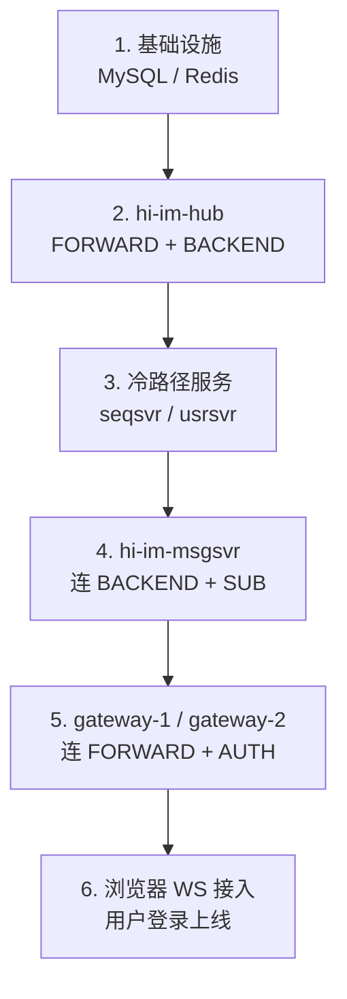
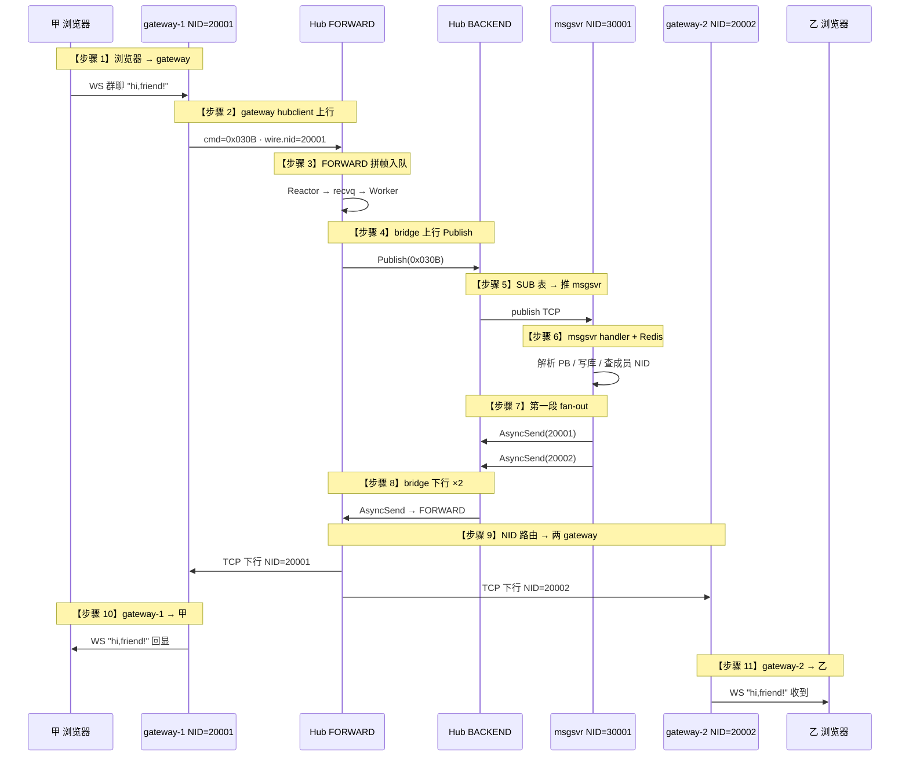

# 群聊的订阅关系梳理

> **用途**：从服务启动顺序到双端浏览器群聊「甲发 hi,friend! → 乙收到」，梳理各层订阅/绑定关系。  
> **关联**：[群聊故事线串 hi-im 核心业务 + hi-im-core 线程模型](./群聊故事线串起来hi-im核心业务+hi-im-core的线程模型辅助迅速掌握hi-im.md)（用 §5 故事线掌握框架） · [一个帧串起来hub四角色(线程模型).md](./一个帧串起来hub四角色(线程模型).md)（真实 gateway hex 穿梭四角色）

---

## 1. 部署拓扑（M6）

```text
uid=100001（甲）→ gateway-1  NID=20001  ws :28080  ──┐
uid=100002（乙）→ gateway-2  NID=20002  ws :28081  ──┼──► Hub FORWARD :28888
                                                    │
msgsvr NID=30001                                  ──┼──► Hub BACKEND  :28889
usrsvr / seqsvr / Redis / MySQL
```

---

## 2. 各服务按顺序启动



| 顺序 | 服务 | 启动后立刻建立的关系 |
|------|------|----------------------|
| 1 | **MySQL / Redis** | 无 Hub 关系；后续存群成员、会话 |
| 2 | **hi-im-hub** | 监听 `:28888` / `:28889`；SUB 表、NID 表为空 |
| 3 | **seqsvr / usrsvr** | 一般不连 Hub 热路径（gRPC 冷路径） |
| 4 | **msgsvr** | hubclient → BACKEND `AUTH` + **`SUB(0x030B GROUP-CHAT)`** |
| 5 | **gateway-1/2** | hubclient → FORWARD `AUTH`（**不 SUB 业务 cmd**） |
| 6 | **浏览器** | WS 连 gateway；gateway 记 `uid ↔ ws 连接` |

**要点**：Hub 的 SUB 表只有在 msgsvr 启动并完成 SUB 之后才有群聊条目；gateway 上线只往 NID 表写绑定，不 SUB。

---

## 3. 通俗理解：msgsvr 订阅 cmd=0x030B 之后发生什么

可以这么记（基本正确，下面会补细节）：

> **服务启动时**，msgsvr 作为一个 **hubclient 代理**（连 BACKEND 平面），主动向 Hub 发送 `SUB_REQ`，订阅 **`cmd=0x030B`（GROUP-CHAT）**。  
> Hub 在 **BACKEND 的 SUB 表**里记下：「谁关心 0x030B？→ msgsvr 这条 TCP 连接」。

之后任何用户在群里发消息：

1. **上行**：gateway 把 WS 群聊帧封装成 bus wire 业务帧，**`type/cmd = 0x030B`**，发到 Hub **FORWARD**
2. FORWARD bridge 转成 **BACKEND Publish(0x030B, payload)**
3. Hub **BACKEND** 查 SUB 表：「谁订阅了 0x030B？」→ 找到 **msgsvr**
4. Hub 把这一帧 **TCP 推给 msgsvr**（不是调 Go 函数，是 hubclient 收到下行帧；msgsvr 进程内再 dispatch 到对应 handler）
5. **msgsvr handler** 解析业务（Protobuf、写库等），查 **Redis 群成员** 得到各成员的 **gateway NID**
6. msgsvr 对每个 gateway NID 调 **hubclient AsyncSend**，帧进 Hub **BACKEND**；payload 里 IM 头 **`dest_nid = 目标 gateway NID`**
7. BACKEND bridge 读 `dest_nid` → **FORWARD AsyncSend** → Hub 按 **NID 表** 找到 gateway-1 / gateway-2 的 TCP 连接写出
8. 各 gateway 收到后转 **WebSocket** 推给对应用户

**更精确的说法**：

| 通俗说法 | 精确说法 |
|----------|----------|
| Hub 找到 msgsvr 的 handler | Hub **不执行** msgsvr 的 Go handler；只按 SUB 表 **把帧推到 msgsvr 的 TCP 连接**，handler 在 msgsvr 进程内跑 |
| hub-BACKEND 下行平面 | Publish 查 SUB、AsyncSend 查 NID 都在 **BACKEND HubContext**；下行到 gateway 还要经 **bridge → FORWARD** |
| 任何群消息都带 cmd=0x030B | 上行业务帧 wire.type = 0x030B；bridge 用此 cmd 做 Publish |

---

## 4. 涉及到的订阅/绑定关系（四层）

### 4.1 Hub SUB 表（bus wire `SUB_REQ`）

| 连接方 | 平面 | AUTH NID | SUB | 作用 |
|--------|------|----------|-----|------|
| **msgsvr** | BACKEND :28889 | 30001 | **`SUB(0x030B)`** | 上行 Publish 时推给 msgsvr |
| **gateway-1** | FORWARD :28888 | 20001 | **不 SUB 业务 cmd** | 只收 AsyncSend 下行 |
| **gateway-2** | FORWARD :28888 | 20002 | **不 SUB 业务 cmd** | 同上 |

```text
SUB 表（publish 用，按 cmd 广播）：
  0x030B → [ { sid=msgsvr会话, nid=30001, reactor_idx=… } ]
```

**群聊热路径里，Hub 侧唯一的业务 SUB：msgsvr SUB 了 GROUP-CHAT。**

### 4.2 Hub NID 表（AUTH 绑定，async_send 用）

```text
NID 表（单播用，按 dest_nid 找连接）：
  20001 → gateway-1  hubclient TCP
  20002 → gateway-2  hubclient TCP
  30001 → msgsvr     hubclient TCP
```

### 4.3 业务层（Redis，Hub 不认）

| 关系 | 维护方 | 作用 |
|------|--------|------|
| `gid → {uid, gateway NID}` | msgsvr + Redis | 第一段 fan-out：该 AsyncSend 到哪些 gateway NID |

### 4.4 接入层（gateway 内存，Hub 不认）

| 关系 | 维护方 | 作用 |
|------|--------|------|
| `uid ↔ WebSocket` | 各 gateway | Hub 下行到 gateway 后，推到正确浏览器 |

---

## 5. 甲发「hi,friend!」→ 乙收到（完整全链路）

**重要补全**：msgsvr fan-out 时会对 **所有群成员所在 gateway** 各发一帧，包括 **gateway-1（甲自己）** 和 **gateway-2（乙）**。

**编号约定**：下文流程图与 5.1 对照表 **统一为 11 步**（同序号同含义）。流程图使用 `Note` + 箭头标注步骤（不用浅色 `rect` 背景，避免深色主题下文字看不清）。



### 5.1 分阶段对照表（与上图 11 步一一对应）

| 步骤 | 谁 | 做什么 | 用到的关系 |
|------|-----|--------|------------|
| **1** | 甲浏览器 | WS 发群聊 `"hi,friend!"` | gateway uid↔ws |
| **2** | gateway-1 | hubclient 上行（wire cmd=0x030B） | NID 表 20001 |
| **3** | Hub FORWARD | Reactor 拼帧 → recvq → Worker | — |
| **4** | bridge（FORWARD） | `peer.Publish(0x030B)` → BACKEND | — |
| **5** | Hub BACKEND | 查 SUB 表，publish 推到 msgsvr TCP | **SUB(0x030B)→msgsvr** |
| **6** | msgsvr handler | 解析 PB、写库、Redis 查 gid→成员 NID | **gid→成员 NID** |
| **7** | msgsvr | `AsyncSend(20001)` + `AsyncSend(20002)` 进 BACKEND | NID 表 |
| **8** | bridge（BACKEND） | `ReadDestNid` → FORWARD `AsyncSend` ×2 | — |
| **9** | Hub FORWARD | 按 NID 表分别 TCP 下行到 gateway-1 / gateway-2 | **NID 表 20001/20002** |
| **10** | gateway-1 | WS 推给甲（发者回显） | uid↔ws |
| **11** | gateway-2 | WS 推给乙（接收者） | uid↔ws |

> **旧版为何是 9 步？** 曾把步骤 3+4（FORWARD 内部 + bridge 上行）、步骤 10+11（两个 gateway WS）各合并成一步；细拆后与服务实际执行更一致，故统一为 11 步。

### 5.2 双段 fan-out（含 gateway-1 下行）

```text
┌──────────────────────────────────────────────────────────────────┐
│ 第一段 · msgsvr @ BACKEND（业务 fan-out）                         │
│   Redis: gid → { 甲@20001, 乙@20002 }                            │
│   for nid in {20001, 20002}:                                      │
│     hubclient.AsyncSend(dest_nid=nid, payload="hi,friend!")       │
├──────────────────────────────────────────────────────────────────┤
│ 第二段 · bridge + FORWARD（总线 fan-out）                         │
│   每帧 ReadDestNid → FORWARD AsyncSend(20001)  → gateway-1 → 甲  │
│                    → FORWARD AsyncSend(20002)  → gateway-2 → 乙  │
└──────────────────────────────────────────────────────────────────┘
```

**所以完整链路必须包含 gateway-1 下行**：甲作为群成员，msgsvr 也会给 20001 发一帧（发者回显/多端同步）；乙在 20002 收到目标消息。

---

## 6. 订阅关系总表（背诵用）

```text
┌─────────────────────────────────────────────────────────────────┐
│ ① Hub SUB（bus wire SUB_REQ）                                    │
│    msgsvr @ BACKEND  ──SUB──►  cmd=0x030B GROUP-CHAT            │
│    gateway @ FORWARD ──不 SUB── 业务 cmd                         │
├─────────────────────────────────────────────────────────────────┤
│ ② Hub NID 绑定（AUTH，async_send / publish 投递用）               │
│    20001 ↔ gateway-1    20002 ↔ gateway-2    30001 ↔ msgsvr      │
├─────────────────────────────────────────────────────────────────┤
│ ③ 业务群成员（Redis，msgsvr handler 查）                          │
│    gid ──► { 100001@20001, 100002@20002, … }                    │
├─────────────────────────────────────────────────────────────────┤
│ ④ 接入会话（gateway 内存，Hub 不可见）                            │
│    gateway-1: uid 100001 ↔ WebSocket                             │
│    gateway-2: uid 100002 ↔ WebSocket                             │
└─────────────────────────────────────────────────────────────────┘
```

---

## 7. 逐步回答：涉及哪些订阅关系

从启动到乙收到「hi,friend!」：

1. **Hub SUB（必须，仅 msgsvr 一条业务订阅）**  
   msgsvr 启动时 `SUB(0x030B)` → 上行 Publish 才能找到 msgsvr

2. **Hub NID 绑定（AUTH，不是 SUB）**  
   gateway-1/2、msgsvr 的 NID 必须在 NID 表里，下行 AsyncSend 才能路由

3. **Redis 群成员（业务「订阅」，Hub 不管）**  
   gid 下含甲、乙及各自 gateway NID → msgsvr 知道 fan-out 到 20001 和 20002

4. **gateway WS 会话**  
   乙已连 gateway-2 → 才能把 Hub 下来的帧推到浏览器

5. **gateway 不 SUB 0x030B**  
   避免与 msgsvr 重复收 publish；gateway 只走上行 AsyncSend + 下行被 AsyncSend

---

## 8. 一句话总结

> **启动时 msgsvr 作为 hubclient 订阅了 `cmd=0x030B`；用户群聊上行业务帧带同一 cmd，FORWARD bridge Publish 后 BACKEND 按 SUB 表把帧推到 msgsvr；msgsvr handler 查 Redis 得到各 gateway NID，对每个 NID 做 AsyncSend（含 20001 和 20002）；bridge 再按 IM.dest_nid 转到 FORWARD，分别下行到 gateway-1（甲回显）和 gateway-2（乙收到）。**

---

## 10. 易混点：两种 handler、两种 dispatch

### 10.1 msgsvr 的 dispatch ≠ hi-im-core 的 Distributor

| 名字 | 在哪 | 干什么 |
|------|------|--------|
| **Distributor**（四角色之一） | **hi-im-hub 进程内** C++ 线程 | 从 **distq** Pop → 投 **sendq** → 唤醒 Reactor 写 TCP |
| **dispatch**（泛指分发） | **msgsvr Go 进程内** | hubclient 从 TCP **读到一帧** → 查本地表 → 调 Go 回调 |

两者**完全无关**：Distributor 是 Hub 出站流水线的一环；msgsvr 里的 dispatch 是 Go hubclient 库收到 Hub 推来的帧之后的**进程内回调**。

```text
Hub 进程内：  Worker → distq → 【Distributor】 → sendq → Reactor → TCP 写出
                                              ↓
msgsvr 进程内：                              hubclient recv → 【Go handler】业务逻辑
```

### 10.2 msgsvr 启动时「上报」了什么？

msgsvr **不会**把 handler 发给 hi-im-core。通过 TCP 只发：

| 报文 | 作用 | Hub 记什么 |
|------|------|------------|
| `AUTH_REQ` | 认证 + 声明 NID=30001 | **NID 表**：30001 → 这条 TCP |
| `SUB_REQ(0x030B)` | 声明要收群聊 cmd | **SUB 表**：0x030B → msgsvr 连接 |

Hub **只记「谁关心哪个 cmd」**，不记、也拿不到 Go 函数指针。

### 10.3 msgsvr 进程里的 handler 究竟是什么？

是 **msgsvr 自己在启动时用 Go hubclient 库本地注册的回调函数**，类似：

```go
// 伪代码，示意 hi-im-hubclient / hi-im-proxy 用法
hubclient.RegisterHandler(0x030B, func(frame []byte) {
    // 解析 Protobuf 群聊体
    // 写 MySQL
    // 查 Redis gid → 成员 gateway NID
    // 循环 hubclient.AsyncSend(dest_nid, payload)
})
hubclient.Subscribe(0x030B)   // 对应 wire SUB_REQ，告诉 Hub
hubclient.Connect(BACKEND, nid=30001)
```

| 注册位置 | 谁注册 | Hub 是否知道 |
|----------|--------|--------------|
| `hubclient.RegisterHandler(0x030B, fn)` | msgsvr **进程内** Go 代码 | **不知道** |
| `SUB_REQ(0x030B)` over TCP | msgsvr hubclient | **知道**，写入 SUB 表 |

**对照 hi-im-core 内部**（同一概念、不同进程）：

| 进程 | handler 注册 | 谁消费 |
|------|--------------|--------|
| **hi-im-hub** | `RegisterBridgeHandlers` → `RegisterHandler(0, bridgeFn)` | **Worker** `FindHandler` → 调 C++ 函数 |
| **msgsvr** | Go `RegisterHandler(0x030B, onGroupChat)` | **hubclient recv 协程** → 调 Go 函数 |

### 10.4 一帧群聊消息的两段 handler

```text
【Hub 内 · C++ handler】
  FORWARD Worker: bridge ForwardUplinkHandler → peer.Publish
  BACKEND Worker: bridge BackendDownlinkHandler → peer.AsyncSend
  （bridge 是 Hub 里 cmd=0 的默认 handler，不是 msgsvr 的）

【msgsvr 内 · Go handler】
  hubclient 收到 Hub publish 下来的 0x030B 帧
  → 本地 map[0x030B] → onGroupChat(payload)
  → Redis fan-out → hubclient.AsyncSend
```

### 10.5 一句话

> **SUB 是 msgsvr 告诉 Hub「有 0x030B 的帧请推到我这根 TCP」；handler 是 msgsvr 告诉自己进程里的 hubclient「推到 TCP 后请调这个 Go 函数」。Hub 的 Distributor 只管 Hub 内部出站队列，和 msgsvr 的 handler 分发是两回事。**

---

## 11. 源码与文档索引

| 内容 | 位置 |
|------|------|
| SUB 注册 | `reactor.cpp` `HandleSystem` → `kSubReq` |
| SUB 表查询 | `router.cpp` `FindSubscribers` → `context_impl.cpp` `Publish` |
| bridge 上行 | `bridge.cpp` `ForwardUplinkHandler` |
| bridge 下行 | `bridge.cpp` `BackendDownlinkHandler` |
| 双平面专题 | [theme/04](../theme/04-双平面FORWARD与BACKEND.md) |
| publish/async_send | [theme/05](../theme/05-async_send与publish路由.md) |
