# 跟一条消息读代码 — hi-im-core 逐函数导读

> **用途**：第一遍读懵之后的「第二遍地图」。跟着一条群聊上行业务帧，从 TCP 进入到 TCP 写出，按函数顺序打卡源码。  
> **前提**：先扫一眼 [im-core源码阅读对照.md](./im-core源码阅读对照.md) 的队列表，或 [theme/02-SPSC与MPSC队列语义.md](../theme/02-SPSC与MPSC队列语义.md)。  
> **案例**：gateway-2（NID=20002）向 FORWARD 发一条 `0x030B` 群聊上行帧 → bridge Publish → msgsvr（BACKEND SUB）收到。

---

## 0. 读之前只记三句话

1. **Reactor 只管 IO**（收包、拼帧、写 socket），不做业务路由。
2. **Worker 只管逻辑**（handler、bridge、Publish/AsyncSend 入队），不碰 socket。
3. **Distributor 只管搬运**（distq → sendq），不做查表。

所有「绕路」都是为了：**多线程但不锁 socket、不锁 sendq**。

---

## 1. 进程启动：谁先跑起来

读消息之前，先知道各线程怎么就位。入口在 `hub_server.cpp`：

```46:76:src/hub/hub_server.cpp
bool HubServer::Start() {
  // ...
  forward_listener_ = std::make_unique<Listener>(*forward_, reactors);
  backend_listener_ = std::make_unique<Listener>(*backend_, reactors);
  // Listener 先 Start（accept 线程）

  forward_dist_ = std::make_unique<Distributor>(*forward_);
  backend_dist_ = std::make_unique<Distributor>(*backend_);
  forward_dist_->Start();
  backend_dist_->Start();
  // Distributor 单线程就位

  for (int i = 0; i < reactors; ++i) {
    auto fr = std::make_unique<Reactor>(*forward_, i, workers);
    auto br = std::make_unique<Reactor>(*backend_, i, workers);
    fr->Start();
    br->Start();
    // Reactor×N 就位
  }
  for (int i = 0; i < workers; ++i) {
    auto fw = std::make_unique<Worker>(*forward_, i);
    auto bw = std::make_unique<Worker>(*backend_, i);
    fw->Start();
    bw->Start();
    // Worker×M 就位
  }
  // ...
}
```

构造时还做了两件大事：

```39:41:src/hub/hub_server.cpp
  forward_ = std::make_unique<HubContext>(Plane::kForward, forward_cfg);
  backend_ = std::make_unique<HubContext>(Plane::kBackend, backend_cfg);
  RegisterBridgeHandlers(*forward_, *backend_);
```

**每个平面**（FORWARD / BACKEND）各自拥有：1 Listener + N Reactor + M Worker + 1 Distributor + 四类队列。双平面之间通过 `SetPeer` + bridge handler 互调。

---

## 2. 阶段 0：连接建立（AUTH / SUB）

在跟业务消息之前，hubclient 必须先完成握手。这一阶段**不经过 Worker**，全在 Reactor 内完成。

### 2.1 新 TCP 进厂

```143:172:src/hub/listener.cpp
void Listener::Run() {
  while (ctx_.Running().load(...)) {
    const int fd = accept(listen_fd_, ...);
    // ...
    const int reactor_idx = PickReactor(reactor_count_);  // 轮询分配
    NewConnection conn{};
    conn.fd = fd;
    conn.sid = ctx_.NextSid();

    auto& q = ctx_.ConnQueue(reactor_idx);
    q.Push(std::move(conn));                    // connq SPSC
    ctx_.ReactorWakeup(reactor_idx).Notify();   // 敲 Reactor 的门
  }
}
```

| 步骤 | 队列 | 生产者 → 消费者 |
|------|------|----------------|
| accept | `connq[i]` | Listener → Reactor[i] |

### 2.2 Reactor 接管连接

Reactor 被唤醒后，在 `HandleReadable` 里发现是唤醒 fd，则：

```321:326:src/hub/reactor.cpp
void Reactor::HandleReadable(int fd) {
  if (fd == ctx_.ReactorWakeup(idx_).Fd()) {
    ctx_.ReactorWakeup(idx_).Drain();
    DrainNewConnections();   // 从 connq 取 fd，加入 epoll
    DrainSendQueue();        // 顺便清空待发
    return;
  }
```

```131:152:src/hub/reactor.cpp
void Reactor::DrainNewConnections() {
  auto& q = ctx_.ConnQueue(idx_);
  while (auto conn = q.Pop()) {
    Session session{};
    session.sid = conn->sid;
    session.fd = conn->fd;
    // ...
    epoll_ctl(epfd_, EPOLL_CTL_ADD, s.fd, &ev);  // 开始监听可读
  }
}
```

**从此这条 TCP  stick 在这个 Reactor 线程上**，不会再迁移。

### 2.3 AUTH：登记 NID 路由表

客户端发 `AUTH_REQ`（系统帧 flag=0），Reactor 拼出完整帧后走 `HandleSystem`：

```222:244:src/hub/reactor.cpp
bool Reactor::HandleSystem(Session& session, const FrameView& frame) {
  switch (static_cast<SysCmd>(type)) {
    case SysCmd::kAuthReq: {
      // 校验 user/pass ...
      session.authed = true;
      session.nid = BeToHost32(auth.nid);
      ctx_.GetRouter().BindNid(session.nid, session.sid, idx_);  // NID 表
      SendBytes(session, ack);   // AUTH_ACK 直接在本线程写出
      return true;
    }
```

msgsvr 在 BACKEND 上还要 SUB 群聊 cmd：

```246:258:src/hub/reactor.cpp
    case SysCmd::kSubReq: {
      const uint32_t cmd = BeToHost32(cmd_be);
      Subscriber sub{session.gid, session.sid, session.nid, idx_};
      ctx_.GetRouter().Subscribe(cmd, sub);   // SUB 表
      SendBytes(session, ack);                // SUB_ACK
```

| 表 | 写入时机 | 给谁用 |
|----|----------|--------|
| `nid_map_` | AUTH | `AsyncSend` 按 dest_nid 找连接 |
| `sub_table_` | SUB | `Publish` 按 cmd 找订阅者 |

---

## 3. 阶段 1：上行业务帧（gateway → FORWARD → recvq → Worker）

假设 gateway-2 已 AUTH，发来一帧业务消息（flag=1, type=0x030B）。

### 3.1 收字节、拼帧

```335:349:src/hub/reactor.cpp
  uint8_t buf[65536];
  const ssize_t n = recv(session.fd, buf, sizeof(buf), 0);
  session.fb.Append(...);                      // 流入拼帧缓冲
  while (auto frame = session.fb.TryPopFrame()) {
    if (flag == kFlagSys) {
      HandleSystem(session, *frame);
    } else {
      EnqueueInbound(session, std::move(*frame));  // 业务帧 → 下一步
    }
  }
```

拼帧逻辑在 `src/wire/frame_buffer.hpp`：凑够 `20 + length` 且 chksum 合法才弹出。

### 3.2 入 recvq，交给 Worker

```285:318:src/hub/reactor.cpp
void Reactor::EnqueueInbound(Session& session, FrameView frame) {
  InboundMessage msg{};
  msg.sid = session.sid;
  msg.reactor_idx = idx_;
  msg.nid = session.nid;
  msg.type = ...;   // 0x030B
  msg.payload = std::move(frame.payload);

  const int worker_idx = PickWorker(session.sid);  // sid % worker_count
  auto& q = ctx_.RecvQueue(worker_idx);
  PushWithBackoff(q, std::move(msg));              // recvq MPSC
  ctx_.WorkerWakeup(worker_idx).Notify();
}
```

| 步骤 | 队列 | 生产者 → 消费者 |
|------|------|----------------|
| 业务入站 | `recvq[j]` | Reactor[i] → Worker[j] |

**stick 规则**：同一 `sid` 永远进同一个 Worker（`sid % M`），保证单连接消息有序处理。

### 3.3 Worker 消费，调 handler

```70:101:src/hub/worker.cpp
void Worker::Run() {
  auto& q = ctx_.RecvQueue(idx_);
  while (ctx_.Running().load(...)) {
    // epoll_wait WorkerWakeup → Drain
    while (auto msg = q.Pop()) {
      MessageHandler handler = ctx_.FindHandler(msg->type);
      if (!handler) {
        handler = ctx_.FindHandler(0);   // 没注册则走默认 handler（bridge）
      }
      if (handler) {
        handler(ctx_, *msg);
      }
    }
  }
}
```

FORWARD 平面上，cmd=0 的默认 handler 就是 bridge 上行逻辑。

---

## 4. 阶段 2：bridge 上行（FORWARD → BACKEND Publish）

```31:39:src/hub/bridge.cpp
void ForwardUplinkHandler(HubContext& ctx, const InboundMessage& msg) {
  HubContext* peer = ctx.Peer();           // 拿到 BACKEND 平面
  const Status st = peer->Publish(msg.type, msg.payload.data(), msg.payload.size());
}
```

`Publish` 在 BACKEND 的 `context_impl.cpp`：

```103:124:src/hub/context_impl.cpp
Status Publish(HubContext& ctx, uint32_t cmd, ...) {
  const auto subs = ctx.GetRouter().FindSubscribers(cmd);  // 查 SUB 表
  if (subs.empty()) return NotFound;

  for (const auto& sub : subs) {
    auto frame = EncodeFrame(cmd, sub.nid, kFlagExp, data);
    OutboundFrame out{};
    out.sid = sub.sid;
    out.reactor_idx = sub.reactor_idx;
    out.bytes = std::move(frame);
    PushWithBackoff(ctx.DistQueue(), std::move(out));      // distq MPSC
  }
  ctx.DistWakeup().Notify();
  return Ok();
}
```

**注意**：Publish 自己不写 TCP。它只是「查 SUB 表 → 为每个订阅者生成一帧 → 扔进 BACKEND 的 distq」。

| 步骤 | 队列 | 生产者 → 消费者 |
|------|------|----------------|
| publish 出站 | `distq`（BACKEND） | Worker → Distributor |

---

## 5. 阶段 3：Distributor → sendq → Reactor 写出

BACKEND 的 Distributor 被唤醒后：

```97:125:src/hub/distributor.cpp
void Distributor::Run() {
  while (ctx_.Running().load(...)) {
    // DistWakeup.Drain()
    while (auto frame = ctx_.DistQueue().Pop()) {
      RouteToSendQueue(ctx_, std::move(*frame));
    }
  }
}
```

```38:53:src/hub/distributor.cpp
bool RouteToSendQueue(HubContext& ctx, OutboundFrame frame) {
  auto& sendq = ctx.SendQueue(frame.reactor_idx);
  PushWithBackoff(sendq, std::move(frame));           // sendq SPSC
  ctx.ReactorWakeup(frame.reactor_idx).Notify();
  return true;
}
```

目标 Reactor 被唤醒后写出：

```155:165:src/hub/reactor.cpp
void Reactor::DrainSendQueue() {
  auto& q = ctx_.SendQueue(idx_);
  while (auto item = q.Pop()) {
    SendBytes(sessions_[item->sid], item->bytes);
  }
}
```

```168:175:src/hub/reactor.cpp
bool Reactor::SendBytes(Session& session, std::span<const uint8_t> data) {
  session.outbuf.insert(session.outbuf.end(), data.begin(), data.end());
  UpdateInterest(session, true, true);   // 关注 EPOLLOUT
  HandleWritable(session.fd);            // 非阻塞 send
}
```

| 步骤 | 队列 | 生产者 → 消费者 |
|------|------|----------------|
| 分拣出站 | `sendq[k]` | Distributor → Reactor[k] |
| 写 TCP | `session.outbuf` | Reactor 本线程 send |

**至此 msgsvr 的 hubclient TCP 上收到 publish 下来的 `0x030B` 帧。**  
再往后（Redis fan-out、持久化）是 Go 业务，不在 im-core 内。

---

## 6. 阶段 4：下行回程（msgsvr → BACKEND → bridge → FORWARD）

下行是另一条线，建议对照 `test/bridge_downlink_test.cpp` 里的 `SendBackendDownlink` 读。

### 6.1 msgsvr 发 AsyncSend 到 BACKEND

msgsvr hubclient 向 `:28889` 写一帧：

- Wire: type=0x030B, nid=30001（msgsvr 自己）, flag=EXP
- Payload IM 头里 **dest_nid=20001**（目标 gateway NID）

帧进入 BACKEND 后，路径与上行相同：**Reactor → recvq → Worker**。

### 6.2 bridge 下行

```42:57:src/hub/bridge.cpp
void BackendDownlinkHandler(HubContext& ctx, const InboundMessage& msg) {
  HubContext* peer = ctx.Peer();                        // FORWARD 平面
  const uint32_t dest_nid = ReadImDestNid(msg);       // 读 IM 头 offset 24
  peer->AsyncSend(msg.type, dest_nid, msg.payload.data(), msg.payload.size());
}
```

```127:147:src/hub/context_impl.cpp
Status AsyncSend(HubContext& ctx, uint32_t cmd, uint32_t dest_nid, ...) {
  const auto route = ctx.GetRouter().FindNidRoute(dest_nid);  // 查 NID 表
  if (!route) return NotFound;

  auto frame = EncodeFrame(cmd, dest_nid, kFlagExp, data);
  OutboundFrame out{};
  out.sid = route->sid;
  out.reactor_idx = route->reactor_idx;
  PushWithBackoff(ctx.DistQueue(), std::move(out));
  ctx.DistWakeup().Notify();
}
```

### 6.3 FORWARD 侧再次 distq → sendq → Reactor

与阶段 3 完全相同，只是发生在 FORWARD 平面。最终 gateway-1 的 TCP 连接收到下行帧。

**双段 fan-out 在代码上的分界**：

| 段 | 谁发起 | im-core 看到的 |
|----|--------|----------------|
| 第一段 | msgsvr 循环 AsyncSend | BACKEND 多次 inbound → bridge |
| 第二段 | bridge ReadDestNid | FORWARD AsyncSend → gateway TCP |

---

## 7. 全链路一张图（上行 + 下行）

```mermaid
flowchart TB
  subgraph uplink["上行 · gateway-2 → msgsvr"]
    A1[TCP 业务帧] --> A2[Reactor 拼帧]
    A2 --> A3[recvq → Worker]
    A3 --> A4[bridge Publish]
    A4 --> A5[BACKEND distq]
    A5 --> A6[Distributor → sendq]
    A6 --> A7[Reactor 写 TCP → msgsvr]
  end

  subgraph downlink["下行 · msgsvr → gateway-1"]
    B1[TCP AsyncSend 帧] --> B2[BACKEND Reactor 拼帧]
    B2 --> B3[recvq → Worker]
    B3 --> B4[bridge ReadDestNid]
    B4 --> B5[FORWARD AsyncSend → distq]
    B5 --> B6[Distributor → sendq]
    B6 --> B7[Reactor 写 TCP → gateway-1]
  end
```



---

## 8. 队列 + 唤醒速查卡（建议打印）

```text
┌──────────┬─────────┬──────────────────────┬──────┐
│ 队列     │ 语义    │ 生产者 → 消费者       │ 唤醒 │
├──────────┼─────────┼──────────────────────┼──────┤
│ connq[i] │ SPSC    │ Listener → Reactor[i]│ ReactorWakeup[i]   │
│ recvq[j] │ MPSC    │ Reactor[*] → Worker[j]│ WorkerWakeup[j]   │
│ distq    │ MPSC    │ Worker[*] → Distributor│ DistWakeup       │
│ sendq[i] │ SPSC    │ Distributor → Reactor[i]│ ReactorWakeup[i]│
└──────────┴─────────┴──────────────────────┴──────┘
```

**谁用 epoll_wait？** Reactor×N、Worker×M、Distributor×1 — 各自等自己的唤醒 fd，顺便干别的活。

**谁直接 send()？** 只有 Reactor（含 AUTH_ACK 等系统帧的即时回复）。

---

## 9. 按顺序打卡（建议边读边勾选）

### 第一遍：只跟上行

- [ ] `hub_server.cpp` — 启动顺序、双平面、RegisterBridgeHandlers
- [ ] `listener.cpp:143-172` — accept → connq
- [ ] `reactor.cpp:131-152` — DrainNewConnections
- [ ] `reactor.cpp:222-258` — AUTH / SUB 建表
- [ ] `reactor.cpp:335-349` — recv 拼帧
- [ ] `reactor.cpp:285-318` — EnqueueInbound → recvq
- [ ] `worker.cpp:70-101` — Pop → handler
- [ ] `bridge.cpp:31-39` — ForwardUplinkHandler
- [ ] `context_impl.cpp:103-124` — Publish → distq
- [ ] `distributor.cpp:97-125` — distq → sendq
- [ ] `reactor.cpp:155-175` — DrainSendQueue → SendBytes

### 第二遍：跟下行

- [ ] `bridge.cpp:42-57` — BackendDownlinkHandler
- [ ] `im/header.hpp:77-84` — ReadDestNid（offset 24，不是 offset 4）
- [ ] `context_impl.cpp:127-147` — AsyncSend → distq
- [ ] `test/bridge_downlink_test.cpp:169-191` — 可执行的下行动态

### 第三遍：理解为什么

- [ ] `queue.hpp` — SpscQueue vs MpscQueue
- [ ] `context_impl.cpp:27-46` — 四类队列在 HubContext 构造时创建
- [ ] `doc/theme/03-Bug2-MPSC误用SPSC.md` — 错用队列的后果

---

## 10. 用测试当「可执行文档」

不用自己拼二进制，直接跑：

```bash
cmake --build build -j
./build/bridge_downlink_test          # 下行双 gateway 路由
./build/hub_integration_test          # 上行 bridge publish（若已编进 build）
# 或
ctest --test-dir build -R 'bridge_downlink|hub_proxy' --output-on-failure
```

| 测试函数 | 验证什么 | 对应本文阶段 |
|----------|----------|--------------|
| `hub_proxy_test` 上行段 | FORWARD 发 → BACKEND msgsvr 收 | 阶段 1–3 |
| `SendBackendDownlink` | BACKEND 发 dest_nid → FORWARD gateway 收 | 阶段 4 |
| `SendBackendDualFanout` | 连发两帧不丢不乱路由 | 阶段 4 × 2 |
| `TestReadDestNidUsesOffset24` | dest_nid 读 offset 24 | bridge 下行关键 |

---

## 11. 读懵高发区 & 破局口诀

| 懵点 | 破局 |
|------|------|
| 为什么 Worker 不直接 send | socket 归 Reactor 线程，跨线程写要锁 |
| Publish 和 AsyncSend 区别 | 前者查 **SUB 表**（cmd），后者查 **NID 表**（dest_nid） |
| bridge 在哪注册 | `RegisterBridgeHandlers`，cmd=0 默认 handler |
| 帧头两层 | Wire 20B（Hub 路由）+ IM 52B（bridge 读 dest_nid） |
| 双平面怎么互调 | `ctx.Peer()->Publish/AsyncSend`，走**对端平面**的 distq |
| 代码跳跃厉害 | **永远跟着队列走**，别按文件名从上到下读 |

---

## 12. 关联文档

| 文档 | 关系 |
|------|------|
| [理解核心1.md](./理解核心1.md) | 群聊业务视角、入参出参、怎么模拟 hubclient |
| [im-core源码阅读对照.md](./im-core源码阅读对照.md) | 体量、模块、精读顺序 |
| [theme/01-epoll-Reactor模型.md](../theme/01-epoll-Reactor模型.md) | Reactor 设计动机 |
| [theme/05-async_send与publish路由.md](../theme/05-async_send与publish路由.md) | 两张路由表详解 |

---

## 13. 30 秒自测：你真的跟完了一条消息吗？

合上代码，口头回答：

1. 新 TCP 连接先进哪个队列？谁消费？
2. AUTH 帧走 recvq 吗？为什么？
3. 上行业务帧从 Reactor 到 Worker 经过什么队列？
4. bridge 上行调的是 Publish 还是 AsyncSend？
5. Publish 之后谁写 TCP？在哪几个函数里？
6. 下行 bridge 从 payload 哪个 offset 读 dest_nid？
7. 为什么 DistQueue 必须是 MPSC？

七个都能答上来，第二遍就算读通了。
