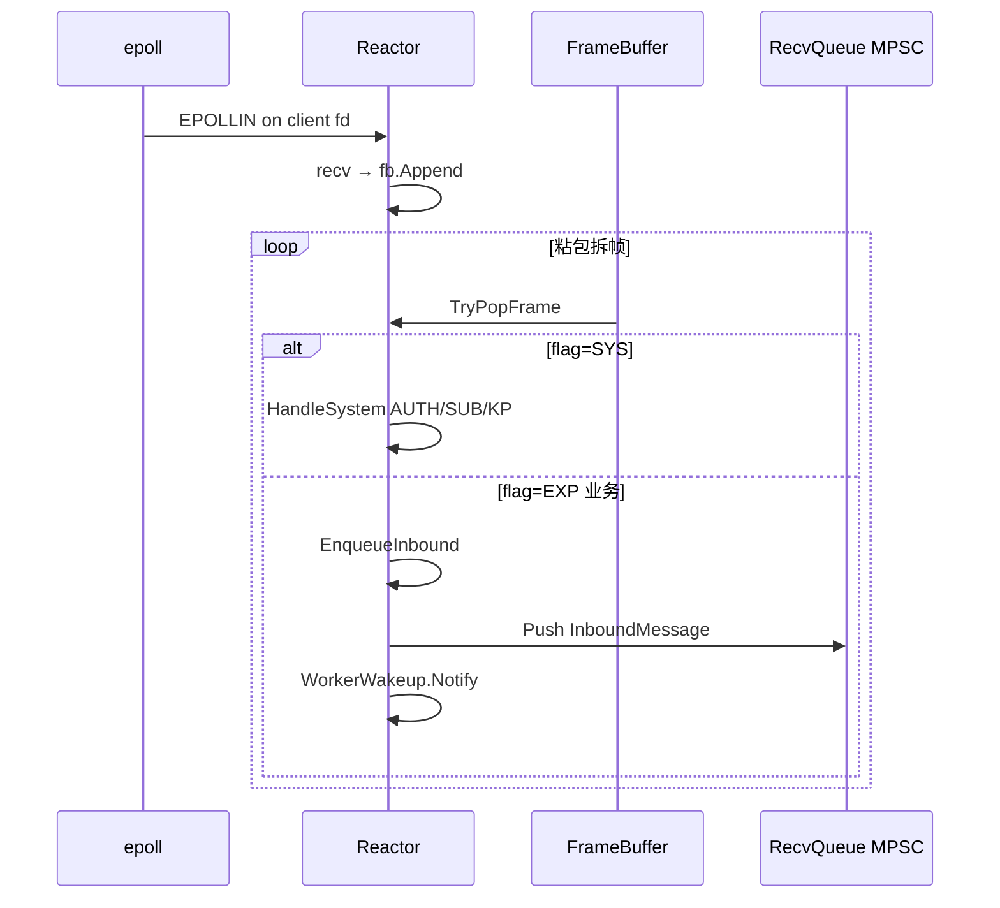
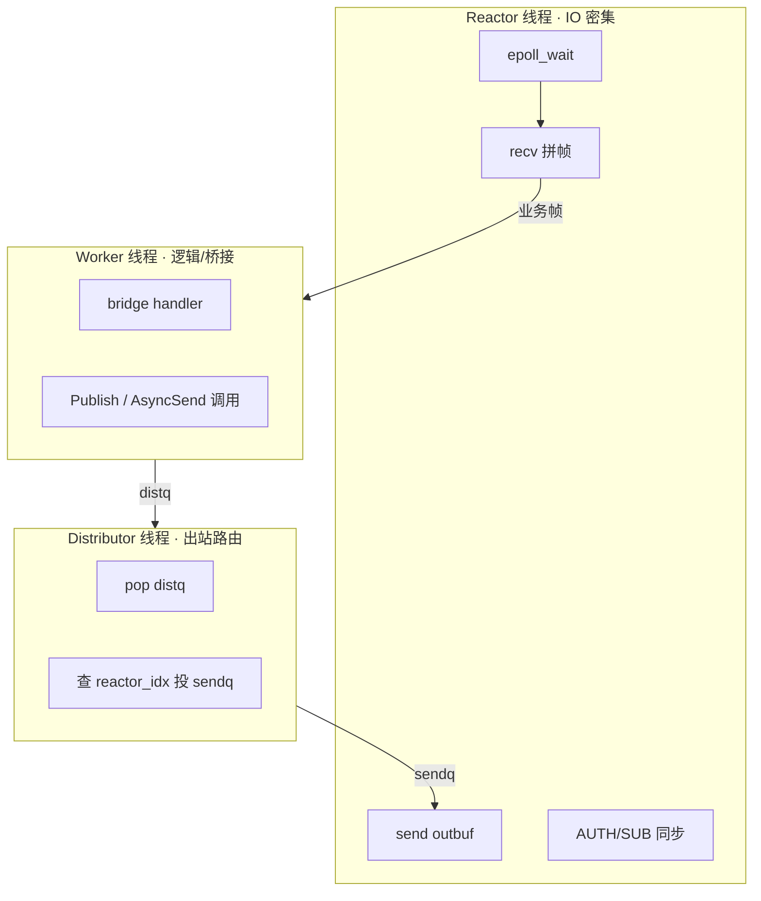

# 专题 1 — epoll 与 Reactor 模型

> **背诵目标**：能白板画出 Hub 单平面线程模型，并解释「为什么连接 stick 到 Reactor」「为什么 Distributor 不直接写 TCP」。

---

## 1. hi-im-core 里的 Reactor 是什么

**Reactor** = 一个专用 IO 线程 + 一个 `epoll` 实例，负责：

1. 管理本线程上的 **所有 Proxy TCP 连接**（gateway / msgsvr 的 hubclient）
2. **读**：`recv` → `FrameBuffer` 拼帧 → 系统帧本地处理 / 业务帧入 `RecvQueue`
3. **写**：从 `SendQueue` 取 outbound → 写入 `outbuf` → `send`（EAGAIN 时注册 EPOLLOUT）

对应必嗨 `rtmq_rsvr`；代码：`src/hub/reactor.cpp`、`src/hub/reactor.hpp`。

**一个 Hub 平面**（FORWARD 或 BACKEND）默认配置：

```text
Listener ×1
Reactor   ×N   （cfg.reactor_threads，默认 4）
Worker    ×M   （cfg.worker_threads，默认 4）
Distributor ×1
```

双平面时上述组件 **各有一套**（`hub_server.cpp` 里 forward/backend 各启一份）。

---

## 2. epoll 在 Reactor 里怎么用

### 2.1 初始化

```cpp
epfd_ = epoll_create1(EPOLL_CLOEXEC);
// 1) 注册 wakeup pipe/eventfd —— 跨线程唤醒
epoll_ctl(epfd_, EPOLL_CTL_ADD, ReactorWakeup(idx).Fd(), EPOLLIN);
// 2) 新连接 accept 后 EPOLL_CTL_ADD，默认 EPOLLIN
// 3) 有数据要写时 EPOLL_CTL_MOD，加 EPOLLOUT
```

### 2.2 主循环（`Reactor::Run`）

```text
while (running) {
  n = epoll_wait(epfd_, events, 64, timeout=0);   // 非阻塞轮询
  for each event:
    EPOLLIN  → HandleReadable(fd)
    EPOLLOUT → HandleWritable(fd)
  DrainSendQueue();   // 兜底：即使没触发 epoll 也尝试发
}
```

**要点**：

| 问题 | 答案 |
|------|------|
| 为什么 `timeout=0`？ | Hub 是常驻服务，Reactor 线程专职 IO；空转时 CPU 可接受，且每轮还会 `DrainSendQueue` |
| LT 还是 ET？ | **水平触发（默认）**；`recv` 读到 EAGAIN 才停，避免 ET 一次没读完就丢事件 |
| socket 非阻塞？ | 是；`EAGAIN` 时保留 EPOLLOUT 兴趣，下次可写继续 `send` |
| 谁往 epoll 里加 fd？ | **只有本 Reactor 线程**（连接 stick）；Listener 只往 `ConnQueue` 推 fd |

### 2.3 可读路径



**系统帧**（AUTH / SUB / UNSUB / KPALIVE）在 Reactor **同步处理**，不入 Worker：

- `AUTH` 成功 → `Router.BindNid(nid, sid, reactor_idx)` —— 后续 async_send 靠这张表找连接
- `SUB` → `Router.Subscribe(cmd, {gid,sid,nid,reactor_idx})` —— 后续 publish 靠 SUB 表

### 2.4 可写路径

```text
SendBytes → outbuf 追加 → UpdateInterest(READ+WRITE)
HandleWritable → send 循环直到 EAGAIN 或发完
发完 → UpdateInterest(READ only) 去掉 EPOLLOUT
```

**为什么用 outbuf 而不是直接 send？**

- TCP 可能一次 `send` 写不完；outbuf 做 **用户态发送缓冲**，避免丢包
- 与必嗨 snap 发送队列同思路，C++ 用 `std::vector<uint8_t>` RAII

### 2.5 wakeup pipe 的作用

跨线程往 Reactor 塞活：

| 来源 | 触发 | Reactor 收到 wakeup 后 |
|------|------|------------------------|
| Listener | 新连接入 `ConnQueue` | `DrainNewConnections` → epoll_ctl ADD |
| Distributor | outbound 入 `SendQueue` | `DrainSendQueue` → SendBytes |

没有 wakeup，Reactor 可能不知道 sendq 已有数据。hi-im-core 用 `PipeWakeup`（pipe/eventfd）**边写队列边 Notify**。

---

## 3. 连接 stick（同 TCP 固定同 Reactor）

```text
Listener accept → 按策略选 reactor_idx → ConnQueue[reactor_idx].Push({fd, sid})
该 TCP 生命周期内：读、写、Session 都在这个 Reactor 线程
```

**好处**：

1. `sessions_`、`fd_to_sid_` **无锁**（单线程访问）
2. `SendQueue[i]` 可做成 **SPSC**（只有 Distributor 写、Reactor[i] 读）
3. CPU cache 友好，避免多线程抢同一连接

**Worker 分配**（与 stick 不同维度）：

```cpp
worker_idx = sid % worker_count;   // PickWorker
```

同一连接的上行业务帧按 **sid 哈希** 进某个 Worker 的 RecvQueue —— 所以 RecvQueue 是 **多 Reactor 写、单 Worker 读 = MPSC**。

---

## 4. 与 Worker / Distributor 的分工（面试常问）



| 角色 | 做什么 | 不做什么 |
|------|--------|----------|
| **Reactor** | IO、拼帧、系统命令、写 TCP | 不跑 bridge、不查 SUB 表 fan-out |
| **Worker** | 消费 recvq、调 bridge / 注册 handler | 不直接 `send()` 到客户端 TCP |
| **Distributor** | 单线程 pop distq → 投 sendq | 不解析业务 PB，只做「去哪个 Reactor」 |

**设计继承必嗨，核心不变量**：**出站只有 Distributor 写 sendq**，避免多线程同时 Push 同一 SPSC 出错。

---

## 5. 面试背诵卡

**Q：为什么 Hub 用多 Reactor 而不是一个 epoll 线程？**

> 单线程 epoll 在百万连接、高 PPS 时成为瓶颈；多 Reactor 把连接分摊到多核，且连接 stick 后 Per-connection 状态无锁。代价是跨 Reactor 下行要靠 Distributor + sendq 路由。

**Q：epoll 和 io_uring 在 hi-im 里的关系？**

> Phase 1 用 epoll（`reactor.cpp` 已落地）；档 C Phase 2 可选 `-DHIIM_USE_URING=ON`，队列与 Distributor 模型不变，只换 IO 多路复用实现。

**Q：Reactor 里拼帧怎么做？**

> 每 Session 一个 `FrameBuffer`（`wire/frame_buffer.hpp`），`Append` 读到的字节，`TryPopFrame` 按 20B bus wire 头拆包；业务 payload 可能内嵌 52B IM 头（群聊 dest_nid 在 offset 24）。

**Q：macOS 上没有 epoll 怎么办？**

> 代码 `#if __linux__` 用 epoll，否则 **kqueue**（`reactor.cpp` 双分支），面试可提「可移植 Reactor，Linux 生产路径是 epoll」。

---

## 6. 源码速查

| 行为 | 文件 | 符号 |
|------|------|------|
| epoll 主循环 | `reactor.cpp` | `Reactor::Run` |
| 注册/修改兴趣 | `reactor.cpp` | `UpdateInterest` |
| 上行入队 | `reactor.cpp` | `EnqueueInbound` |
| 下行出队发送 | `reactor.cpp` | `DrainSendQueue` / `SendBytes` |
| 双平面启动 | `hub_server.cpp` | `HubServer::Start` |
