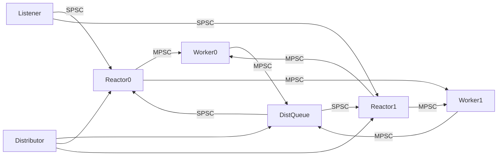

# 专题 2 — SPSC 与 MPSC 队列语义

> **背诵目标**：能说出 Hub **四类队列**各自的生产者/消费者，以及为什么 **不能全局用一种无锁环**。

---

## 1. 先记定义

| 模型 | 全称 | 约束 | hi-im-core 实现 |
|------|------|------|-----------------|
| **SPSC** | Single Producer Single Consumer | 恰好 1 个写者、1 个读者 | `SpscQueue` — 无锁环 + atomic head/tail |
| **MPSC** | Multi Producer Single Consumer | 多个写者、1 个读者 | `MpscQueue` — `mutex` + `deque`（正确性优先） |

代码：`src/hub/queue.hpp`  
类型声明：`include/hiim/hub/context.hpp`（`ConnQueue`/`SendQueue` 用 Spsc，`RecvQueue`/`DistQueue` 用 Mpsc）

---

## 2. Hub 四类队列对照表（必背）

| 队列 | 生产者 | 消费者 | 正确模型 | 唤醒 |
|------|--------|--------|----------|------|
| **ConnQueue[i]** | Listener（分配到 reactor i） | Reactor[i] | **SPSC** | ReactorWakeup |
| **RecvQueue[j]** | Reactor 0..N-1（`PickWorker(sid)`） | Worker[j] | **MPSC** | WorkerWakeup |
| **DistQueue** | Worker 0..M-1 + `Publish`/`AsyncSend` | Distributor ×1 | **MPSC** | DistWakeup |
| **SendQueue[i]** | Distributor ×1 | Reactor[i] | **SPSC** | ReactorWakeup |



---

## 3. SpscQueue 实现要点（面试可讲）

```cpp
// queue.hpp — 简化理解
bool Push(T value) {
  tail = tail_.load(relaxed);
  next = (tail + 1) % capacity_;
  if (next == head_.load(acquire)) return false;  // 满
  slots_[tail] = move(value);
  tail_.store(next, release);
}
```

| 要点 | 说明 |
|------|------|
| 容量 | `capacity_ = 用户容量 + 1`，用空槽区分满/空 |
| 内存序 | tail 用 release、head 用 acquire，保证消费者看到完整写入 |
| cache line | `head_`/`tail_` **alignas(64)** 避免 false sharing |
| 满时行为 | `Push` 返回 false → 上层 `PushWithBackoff` 重试 / 打日志 |

**SPSC 无锁前提**：如果有 **第二个生产者** 同时改 `tail_`，两个线程可能写到同一槽位或跳过槽位 → **内存损坏**，表现就是随机丢包、重复路由（不是「偶尔网络丢」）。

---

## 4. MpscQueue 实现要点

```cpp
bool Push(T value) {
  lock_guard lock(mu_);
  if (queue_.size() >= capacity_) return false;
  queue_.push_back(move(value));
}
```

| 要点 | 说明 |
|------|------|
| 为什么用锁 | MPSC 无锁实现（Vyukov 等）复杂；M1 阶段 **正确性优先** |
| 性能 | 瓶颈通常在 TCP IO，不在队列锁；高 QPS 再考虑 per-worker distq 分片 |
| 背压 | 满则 `kQueueFull`，Hub **at-most-once**，不阻塞 Worker 太久 |

---

## 5. 为什么 Distributor 单线程 + SendQueue SPSC

**设计意图**（技术设计文档 §5.2）：

```text
多个 Worker 可能同时 AsyncSend → 只能有一个线程写 SendQueue[i]
→ 所有 outbound 先进 DistQueue（MPSC）
→ Distributor 单线程 pop，按 route.reactor_idx 投 SendQueue[i]（SPSC）
```

若多个 Worker **直接** Push SendQueue：

- 破坏 SPSC 假设
- 还要在多个 Reactor 之间协调「谁写哪条连接」

所以 **DistQueue 是架构上的汇聚点**，不是为了延迟，是为了 **串行化出站路由**。

---

## 6. RecvQueue 为什么是 MPSC

```text
Reactor0 ──┐
Reactor1 ──┼──► RecvQueue[worker_j] ──► Worker[j]
Reactor2 ──┘
```

- 连接 stick 在 Reactor，但 **Worker 按 sid % M 分配**，任意 Reactor 都可能往同一个 Worker 推消息
- 典型场景：msgsvr 与 gateway 连在不同 Reactor，同时有上行流量 → **多 Reactor 写同一 RecvQueue**

---

## 7. 与 Kafka / Channel 的对比（加分项）

| | Hub 内存队列 | Kafka |
|--|-------------|-------|
| 持久化 | 否 | 是 |
| 语义 | 热路径转发，at-most-once | 日志、可重放 |
| 背压 | 有界队列满则丢/返回 QueueFull | 消费者 lag |
| 选型依据 | **线程拓扑** | **业务削峰** |

Go 里 `chan` 是 MPMC（带锁），Hub 里把模型 **写进类型名**（SpscQueue/MpscQueue），编译期就约束误用。

---

## 8. 面试背诵卡

**Q：怎么判断该用 SPSC 还是 MPSC？**

> 画清楚「谁 Push、谁 Pop」。只有一个写者才能无锁 SPSC；多个 Worker/Reactor 写一个队列就必须 MPSC 或分片成多个 SPSC。

**Q：SendQueue 能不能用 MPSC？**

> 可以，但没必要：Distributor 已经单线程，SPSC 更简单且无锁。关键是 **禁止** Worker 绕过 Distributor 直写 SendQueue。

**Q：未来怎么优化 MpscQueue？**

> 1）每个 Worker 独立 SPSC distq，Distributor round-robin；2）Vyukov 无锁 MPSC；3）按 NID 分片 Hub 降低单队列压力（Phase 2）。

---

## 9. 源码速查

| 队列 | context 访问器 | 类型 |
|------|----------------|------|
| 新连接 | `ConnQueue(i)` | `SpscQueue<NewConnection>` |
| 上行业务 | `RecvQueue(j)` | `MpscQueue<InboundMessage>` |
| 出站汇聚 | `DistQueue()` | `MpscQueue<OutboundFrame>` |
| 下行 IO | `SendQueue(i)` | `SpscQueue<OutboundFrame>` |

初始化：`context_impl.cpp` `HubContext` 构造函数。
