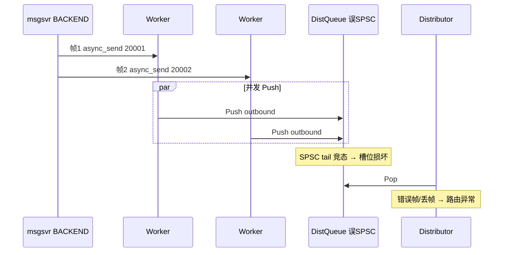
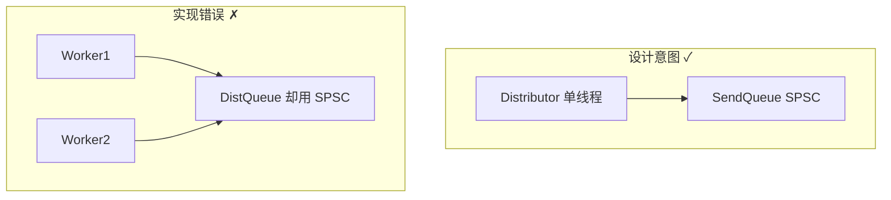

# 专题 3 — Bug2：MPSC 场景误用 SPSC

> **背诵目标**：用 3 分钟讲清 **现象 → 根因 → 为什么架构没错 → 修复 → 验证**；这是 hi-im 面试最有辨识度的故事。

---

## 1. 一句话结论（先背这句）

> **Bug2 = 设计文档写对了「Distributor 单线程消费出站」，但 DistQueue / RecvQueue 在实现里用了 SPSC，而实际是多 Worker、多 Reactor 并发 Push → 无锁环内存损坏 → 跨 Gateway 群聊偶发丢包或重复路由。**

修复：这两类队列改为 `MpscQueue`（`mutex + deque`）。  
**不是** Hub 分层设计错了，是 **队列模型与线程拓扑不匹配**。

---

## 2. 现象（面试开场）

**场景**：M6 双 Gateway 群聊冒烟 — uid=100001 在 gateway-1（NID=20001），uid=100002 在 gateway-2（NID=20002）。

| 观察 | 说明 |
|------|------|
| msgsvr 日志 | fan-out 到 20001、20002 **都成功** |
| 客户端 | B 偶发收不齐 A 的消息 |
| 异常模式 | 同一 `seq` 重复到 GW1、漏投 GW2 |
| 断点 | **hub → gateway-2** 下行路径 |

修复后：`go run . -burst 5` 与浏览器双窗口 **A↔B 各 5 条 100% PASS**。

---

## 3. 根因：哪两个队列错了

| 队列 | 实际拓扑 | 修复前 | 修复后 |
|------|----------|--------|--------|
| **DistQueue** | Worker×M + Publish/AsyncSend **多写**，Distributor **单读** | `SpscQueue` ❌ | `MpscQueue` ✓ |
| **RecvQueue** | Reactor×N **多写**，Worker **单读** | `SpscQueue` ❌ | `MpscQueue` ✓ |
| SendQueue | Distributor 单写，Reactor 单读 | SPSC ✓ | 不变 |
| ConnQueue | Listener 单写，Reactor 单读 | SPSC ✓ | 不变 |

---

## 4. 为什么群聊会触发 Bug2

群聊下行是 **双段 fan-out** 第二段（msgsvr 连 BACKEND）：

```text
msgsvr ──AsyncSend(destNid=20001)──► Hub BACKEND DistQueue
msgsvr ──AsyncSend(destNid=20002)──► Hub BACKEND DistQueue   （同一 TCP、极短间隔）
         bridge ──► FORWARD AsyncSend ──► 各 gateway
```

同时触发两类 MPSC 压力：



1. **多 Worker 并发** `AsyncSend` → 同时 Push **DistQueue**
2. msgsvr **sticky TCP** 连发多帧 → 多 Reactor 可能同时 Push **RecvQueue**
3. SPSC 假设被破坏 → 偶发、难复现（典型 Heisenbug）

---

## 5. SPSC 在并发写时会发生什么（面试深挖）

无锁 SPSC 只允许 **一个线程改 tail、一个线程改 head**。

当两个 Worker 同时 `Push`：

```text
Worker A: 读 tail=5 → 准备写 slots[5]
Worker B: 读 tail=5 → 也写 slots[5]     // 覆盖
Worker A: tail=6
Worker B: tail=6                         // 跳过 slots[5] 的一次有效写入
```

结果：

- 某一帧 **永远丢失**（漏投 GW2）
- 某一槽位被 **写两次**（重复到 GW1）
- 与「网络丢包」不同：**日志里上游 fan-out 全成功**

---

## 6. 设计 vs 实现（重要：别自我否定）

### 文档里写对了

```text
Reactor × N ──recvq──► Worker × M ──Publish/AsyncSend──► distq
Distributor ──pop distq──► sendq[reactor] ──► Reactor 写 TCP
```

要点：**Distributor 单线程**，避免多写 sendq —— **这条架构判断正确**。

### 文档里容易误导

曾笼统写「线程间队列：SPSC 无锁环」，**没有按队列标注生产者数量**。



---

## 7. 修复方案

### 代码变更

| 文件 | 变更 |
|------|------|
| `queue.hpp` | 新增 `MpscQueue` |
| `context.hpp` / `context_impl.cpp` | `RecvQueue`、`DistQueue` 类型改为 `MpscQueue` |
| `SpscQueue` | 仅保留在 `ConnQueue`、`SendQueue` |

### 为什么先用 mutex 而不是无锁 MPSC

1. **先止血**：群聊正确性 > 极致性能
2. DistQueue 瓶颈多在 **Distributor 单线程 pop + TCP**，不在锁
3. 后续 P2：per-worker SPSC distq 或 Vyukov 无锁 MPSC（见问题集合 P2）

---

## 8. 同批另外两 Bug（简带一句，体现排查深度）

| ID | 层级 | 一句话 |
|----|------|--------|
| **Bug1** | bridge | IM 头 52B，`dest_nid` 在 offset **24**，旧代码在 offset 4 读成 **Length** → 路由错 NID |
| **Bug2** | 队列 | 本专题 |
| **Bug3** | 拼帧 | `FrameBuffer::TryPopFrame` 返回悬垂 span，sticky 连 pop 污染 payload |

三者独立；群聊连发可能 **同时踩 Bug2 + Bug3**。面试可说「先日志定位到 hub，再分队列/协议/拼帧三条线验证」。

---

## 9. 验证方式（可背命令）

```bash
# 重建 hub
make m6-heal-down && make m6-heal

# burst 双向各 5 条
cd examples/smoke-group && go run . -burst 5

# core 单测
cd hi-im-core/build && ctest && ./bridge_downlink_test
```

---

## 10. 面试背诵模板（3 分钟）

1. **背景**：跨 Gateway 群聊，msgsvr fan-out 成功但 B 收不齐。  
2. **假设**：断点在 Hub 下行，不是业务层。  
3. **架构回顾**：画出 Worker → DistQueue → Distributor → SendQueue → Reactor。  
4. **发现**：DistQueue 标注 SPSC，实际 Worker×M 多写；RecvQueue 同理。  
5. **原理**：SPSC 双写损坏环缓冲 → 偶发丢/重。  
6. **修复**：改 MpscQueue；SendQueue/ConnQueue 保持 SPSC。  
7. **结论**：**设计对、实现错**；修完后 burst PASS，并补了队列语义文档 §5.3.1。

**收尾金句**：

> 多 Hub 分片后风险会转到 NID 所有权，但 **单进程内先把 MPSC/SPSC 配对搞对** 是必要条件，不是充分条件。

---

## 11. 源码速查

| 内容 | 位置 |
|------|------|
| MpscQueue 定义 | `src/hub/queue.hpp` |
| 队列类型绑定 | `include/hiim/hub/context.hpp` L90-93 |
| AsyncSend 入 DistQueue | `context_impl.cpp` `AsyncSend` |
| bridge 触发 FORWARD AsyncSend | `bridge.cpp` `BackendDownlinkHandler` |
| 问题集合全文 | hi-im `doc/系统问题收集/问题集合1.md` |
