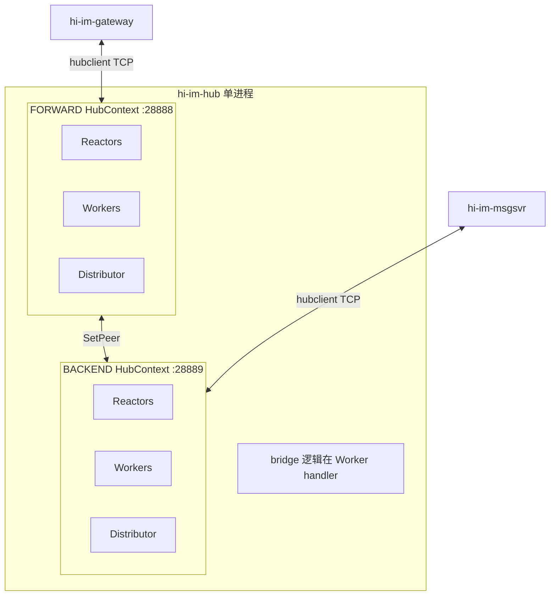
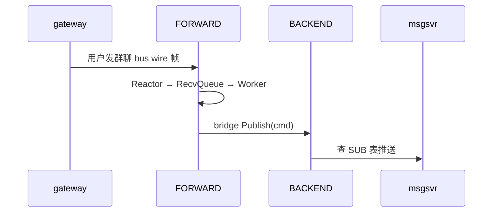
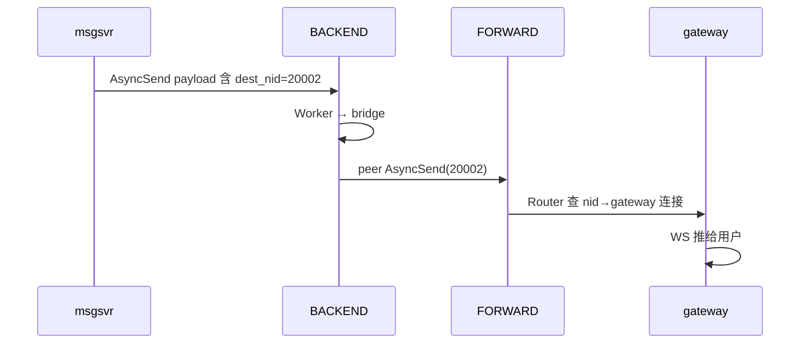

# 专题 4 — 双平面 FORWARD 与 BACKEND

> **背诵目标**：解释「为什么一个 Hub 进程要两套 TCP 端口」「bridge 两条规则」「谁连哪一面」。

---

## 1. 是什么：单进程、双 HubContext

`hi-im-hub` 进程内 **不是两个进程**，而是两个独立的 `HubContext`：

| 平面 | 枚举 | 默认端口 | 连接方 | 角色 |
|------|------|----------|--------|------|
| **FORWARD** | `Plane::kForward` | **28888** | gateway（WebSocket 接入） | 客户端上下行的 **边缘** |
| **BACKEND** | `Plane::kBackend` | **28889** | msgsvr、chatroom、usrsvr、roomfanout | 业务服务的 **Hub 代理** |

代码：`hub_server.cpp` 构造 `forward_` / `backend_`，各启 Listener、Reactor、Worker、Distributor。



**继承必嗨 frwder**：必嗨也是 FORWARD + BACKEND 双平面，hi-im-core 净室重写，端口与语义对齐便于迁移。

---

## 2. 为什么要双平面（面试必问）

| 理由 | 说明 |
|------|------|
| **连接类型分离** | 接入层（海量 WS 转 TCP）与业务层（少量 msgsvr SUB）扩容策略不同 |
| **安全与拓扑** | gateway 只暴露 FORWARD；业务进程在内网连 BACKEND |
| **流量方向清晰** | 上行：边缘进 FORWARD → 业务在 BACKEND 收 publish；下行：业务在 BACKEND async_send → 边缘从 FORWARD 出 |
| **订阅模型** | msgsvr 在 BACKEND **SUB** 群聊 cmd；gateway 在 FORWARD **不 SUB** 业务 cmd，只转发给用户 NID |
| **扩展 Phase 2** | gateway 按 NID 分片只连某 Shard 的 FORWARD；msgsvr 可 multi-backend |

**对比单平面**：若 gateway 与 msgsvr 混连同一端口，SUB 表、安全域、限流策略缠在一起，且不利于「接入无脑扩容、业务按 cmd 订阅」。

---

## 3. bridge 两条规则（核心）

bridge **不是独立进程**，是注册在两边 Worker 上的 **默认 handler（cmd=0）**。

代码：`bridge.cpp` `RegisterBridgeHandlers`

```cpp
forward_ctx.SetPeer(&backend_ctx);
backend_ctx.SetPeer(&forward_ctx);
```

### 规则 1 — FORWARD 上行

```text
FORWARD Worker 收到 gateway 上行业务帧
  → ForwardUplinkHandler
  → peer->Publish(cmd, payload)    // 投到 BACKEND 平面
```



### 规则 2 — BACKEND 下行

```text
BACKEND Worker 收到 msgsvr 下行业务帧（AsyncSend 进来）
  → BackendDownlinkHandler
  → dest_nid = IM MesgHeader.nid（offset 24，52B 头）
  → peer->AsyncSend(cmd, dest_nid, payload)   // 投到 FORWARD 平面
```



**bridge 不解析 Protobuf**，只读 IM 头里的 `dest_nid`（`hiim::im::ReadDestNid`）。业务语义在 msgsvr。

---

## 4. 谁连哪一面、各做什么

| 组件 | 连接平面 | AUTH 后行为 |
|------|----------|-------------|
| **hi-im-gateway** | FORWARD | `BindNid(gateway_nid)`；上行 `AsyncSend` 用户消息；下行收 Hub 推来的帧 |
| **hi-im-msgsvr** | BACKEND | `SUB(GROUP-CHAT)` 等 cmd；处理 publish 来的消息；fan-out 时 `AsyncSend(dest_nid)` |
| **hi-im-chatroom** | BACKEND | SUB 聊天室 cmd |
| **hi-im-usrsvr** | BACKEND | 通常 SUB 较少，偏 HTTP/gRPC 冷路径 |
| **hi-im-roomfanout** | BACKEND | Kafka 消费后再 AsyncSend |

gateway **内嵌 hi-im-hubclient**（Go 纯 TCP 实现 bus wire v1），**不 CGO** 链 hi-im-core。

---

## 5. 双平面与线程模型的关系

**每一套平面都有自己完整的一套**：

```text
Listener + Reactor×N + Worker×M + Distributor + 四类队列
```

FORWARD 的 DistQueue 与 BACKEND 的 DistQueue **互不共享**。  
bridge 跨平面调用的是 **`HubContext::Publish` / `AsyncSend` API**，内部仍走 **目标平面** 的 DistQueue → Distributor → Reactor。

---

## 6. 与 gRPC / Kafka 的边界（防混淆）

| 通道 | 技术 | 用途 |
|------|------|------|
| IM **热路径** | bus wire v1 TCP + 双平面 Hub | 每条聊天毫秒级转发 |
| **冷路径** | gRPC | seqsvr 发号、管理查询 |
| **削峰** | Kafka + roomfanout | 聊天室峰值旁路，再 AsyncSend 进 BACKEND |

面试说：**「Hub 不是用 gRPC 替代每条群聊」** — gRPC 延迟和帧开销不适合热路径。

---

## 7. Phase 2 多 Hub 分片（双平面的扩展）

```text
gateway-1 (NID=20001) → Shard-0 FORWARD
gateway-2 (NID=20002) → Shard-0 FORWARD   （同 shard 不同 NID）
msgsvr → 任意 Shard BACKEND（或配置 multi-backend）
跨 shard async_send → owner shard 转发（Phase 2）
```

**坑**：K8s Deployment 盲扩 Hub → NID 注册在 Pod-A，`async_send` 打到 Pod-B → 丢包。  
**解**：Hub 用 StatefulSet 按 NID 范围分片，gateway **stick 单 shard FORWARD**。

---

## 8. 面试背诵卡

**Q：双平面和双进程有什么区别？**

> 单进程两套 HubContext，共享进程资源但 **队列、Router、SUB 表、端口完全隔离**；bridge 用 `SetPeer` 互调 API，零拷贝转发同一 payload 缓冲。

**Q：为什么上行是 Publish、下行是 AsyncSend？**

> 上行按 **cmd** 找订阅者（msgsvr SUB 了 GROUP-CHAT）→ publish。下行按 **用户 NID** 找 gateway 连接 → async_send(dest_nid)。

**Q：FORWARD 上 msgsvr 能不能 SUB？**

> 技术上可以连，但架构上 **不应该** — 业务 SUB 应在 BACKEND，保持边缘纯粹做接入与 NID 路由。

---

## 9. 源码速查

| 内容 | 文件 |
|------|------|
| 双平面启动 | `src/hub/hub_server.cpp` |
| bridge 注册 | `src/hub/bridge.cpp` |
| Plane 枚举 | `include/hiim/hub/context.hpp` |
| 生态总览 | hi-im `doc/hi-im-档C技术方案设计.md` §3 |
