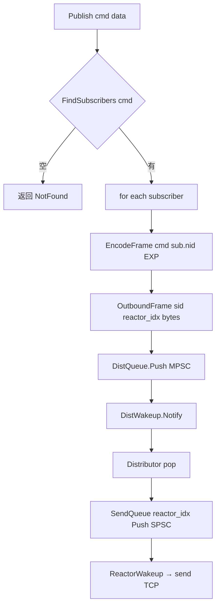
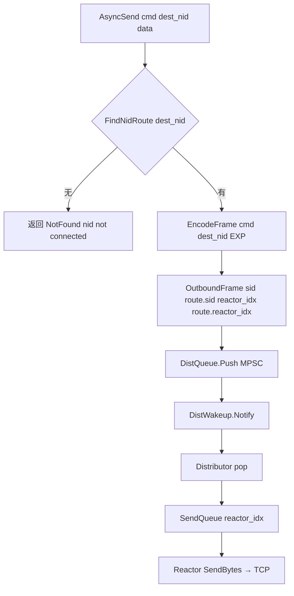
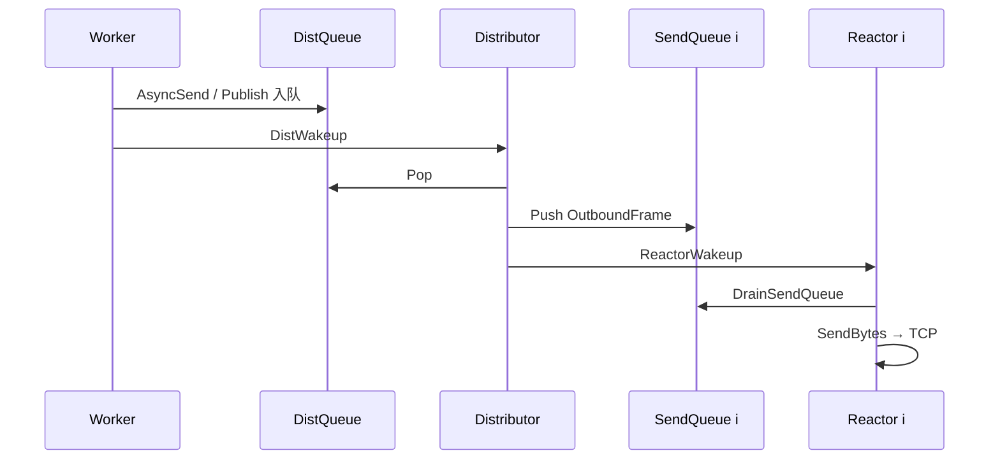

# 专题 5 — async_send 与 publish 路由

> **背诵目标**：讲清两个 API 的 **路由键、查表逻辑、入队路径、Distributor 之后发生了什么**。

---

## 1. 两个 API 一句话对比（必背）

| API | 路由键 | 查表 | 语义 | 典型调用方 |
|-----|--------|------|------|------------|
| **publish(cmd, data)** | **cmd / type** | SUB 表：`cmd → [订阅者…]` | **广播**给所有 SUB 了该 cmd 的连接 | bridge 上行、业务扇出 |
| **async_send(cmd, dest_nid, data)** | **dest_nid** | NID 表：`nid → {sid, reactor_idx}` | **单播**到指定接入 NID | msgsvr fan-out、bridge 下行 |

代码：`context_impl.cpp` 自由函数 `Publish` / `AsyncSend`。

**重要**：publish 在实现上 **展开为多次 async_send 风格的 outbound**，统一进 **DistQueue**，不是另搞一套通道。

---

## 2. Router 两张表

### 2.1 SUB 表（publish 用）

```text
AUTH + SUB 后建立：
  cmd (如 0x030B GROUP-CHAT) → [ {gid, sid, nid, reactor_idx}, ... ]
```

- `Reactor::HandleSystem` 处理 `SUB_REQ` → `Router.Subscribe`
- msgsvr 启动后对需要的 cmd 发 SUB

### 2.2 NID 路由表（async_send 用）

```text
AUTH 成功后：
  nid (如 20001 gateway) → { sid, reactor_idx }
```

- `Reactor::HandleSystem` 处理 `AUTH_REQ` → `Router.BindNid(nid, sid, reactor_idx)`
- 断开连接 → `RemoveSession` 剔除

代码：`src/hub/router.cpp`

---

## 3. publish 完整路径



### 源码逻辑（`context_impl.cpp`）

```cpp
Status Publish(HubContext& ctx, uint32_t cmd, ...) {
  const auto subs = ctx.GetRouter().FindSubscribers(cmd);
  if (subs.empty()) return NotFound;

  for (const auto& sub : subs) {
    auto frame = EncodeFrame(cmd, sub.nid, kFlagExp, data);
    OutboundFrame out{ .sid = sub.sid,
                       .reactor_idx = sub.reactor_idx,
                       .bytes = frame };
    PushWithBackoff(ctx.DistQueue(), out);
  }
  ctx.DistWakeup().Notify();
  return Ok();
}
```

**要点**：

- 每个订阅者一条 outbound（fan-out 在 Hub 层展开）
- `wire` 帧头里的 `nid` 字段填 **订阅者 nid**（不是 dest IM nid）
- 多个订阅者 → **多次 Push DistQueue** → 需要 **MPSC**

---

## 4. async_send 完整路径



### 源码逻辑（`context_impl.cpp`）

```cpp
Status AsyncSend(HubContext& ctx, uint32_t cmd, uint32_t dest_nid, ...) {
  const auto route = ctx.GetRouter().FindNidRoute(dest_nid);
  if (!route) return NotFound;

  auto frame = EncodeFrame(cmd, dest_nid, kFlagExp, data);
  OutboundFrame out{ .sid = route->sid,
                     .reactor_idx = route->reactor_idx,
                     .bytes = frame };
  PushWithBackoff(ctx.DistQueue(), out);
  ctx.DistWakeup().Notify();
  return Ok();
}
```

**要点**：

- `dest_nid` 是 **IM MesgHeader 里的目标用户/网关 NID**（群聊 fan-out 第二段）
- 未连接返回 `NotFound` — **不阻塞、不排队重试**（at-most-once）
- `reactor_idx` 来自 AUTH 时绑定 — Distributor **不用算哈希**，直接投对应 sendq

---

## 5. Distributor 做什么（两 API 汇合点）

`distributor.cpp` — **两个 API 入 DistQueue 后路径完全相同**：

```text
Distributor::Run:
  epoll_wait DistWakeup
  while (frame = DistQueue.Pop())
    SendQueue[frame.reactor_idx].Push(frame)
    ReactorWakeup[frame.reactor_idx].Notify()
```

| 步骤 | 说明 |
|------|------|
| 单线程 pop | 保证 **只有一个线程写 SendQueue[i]** |
| `reactor_idx` | publish 时来自 SUB 记录；async_send 时来自 NID 路由 |
| `sid` | Reactor 找 Session 写 TCP |
| 队列满 | `QueueFull`，打 `[distributor]` 日志，消息丢弃 |



---

## 6. 帧格式：bus wire vs IM 头

### bus wire v1（Hub TCP 上，20 字节头）

```text
Hub 只认：type/cmd、flag(SYS/EXP)、nid、payload
```

### IM 业务头（payload 内，52 字节，big-endian）

```text
offset 24 = dest_nid   ← async_send 路由键来源（群聊）
offset 28 = seq        ← 日志追踪
```

`bridge.cpp` 下行：

```cpp
const uint32_t dest_nid = hiim::im::ReadDestNid(msg.payload);
peer->AsyncSend(msg.type, dest_nid, ...);
```

**Bug1 教训**：offset 4 是 **Length**，不是 nid。

---

## 7. 典型调用链（结合双平面）

### 7.1 用户发群聊（上行 → publish）

```text
浏览器 → gateway → FORWARD AsyncSend(用户帧)
  → bridge → BACKEND Publish(GROUP-CHAT)
  → msgsvr 收到
```

### 7.2 msgsvr fan-out（下行 → async_send × N）

```text
msgsvr 查 Redis：gid → {20001, 20002}
  → BACKEND AsyncSend(20001, payload)
  → BACKEND AsyncSend(20002, payload)
  → bridge → FORWARD AsyncSend(各 dest_nid)
  → gateway → 浏览器
```

**双段 fan-out**：

| 段 | 位置 | 机制 |
|----|------|------|
| 第一段 | msgsvr | 群成员 gid → 各用户 NID，多次 AsyncSend 进 BACKEND |
| 第二段 | bridge + FORWARD | 按 dest_nid 送到各 gateway NID |

---

## 8. 语义与局限（面试诚实项）

| 项 | Hub 保证 | 不保证 |
|----|----------|--------|
| 延迟 | 内存转发，毫秒级 | 跨机房顺序 |
| 投递 | 连接在且队列未满 → 尽力投递 | **恰好一次** |
| 背压 | 队列满返回 QueueFull | 无限缓冲 |
| 多 msgsvr | 多 SUB 同一 cmd 会 **重复 publish** | 单消费者语义 |

业务层应用 **seq + 客户端去重**；msgsvr 部署避免多实例重复 SUB 或配合 Kafka 分片。

---

## 9. Go 侧 hubclient 与 C++ Hub 的关系

| 层 | 组件 | 调用 |
|----|------|------|
| Go 业务 | hi-im-hubclient | `Publish` / `AsyncSend` 封成 bus wire TCP 帧 |
| C++ Hub | Worker 收帧 → handler | 同名的 `HubContext::Publish` / `AsyncSend` |

**热路径不走 gRPC** — hubclient 是纯 Go TCP，与 hi-im-core 二进制协议兼容。

---

## 10. 面试背诵卡

**Q：publish 和 async_send 能不能合并成一个 API？**

> 路由键不同：cmd 广播 vs nid 单播；分开让 SUB 模型和接入 NID 模型正交。实现上 publish 可视为「对 SUB 列表循环 async_send」。

**Q：async_send 找不到 nid 怎么办？**

> 返回 `NotFound`，Hub 不缓存、不重试。msgsvr fan-out 可 best-effort；用户不在线由业务离线逻辑处理。

**Q：为什么 outbound 不直接从 Worker write TCP？**

> 连接 stick 在 Reactor 线程，Worker 跨线程写 socket 要加锁，破坏模型。统一 DistQueue → Distributor → SendQueue → Reactor 是必嗨验证过的路径。

**Q：Distributor 会成为瓶颈吗？**

> 单线程 pop+push，但操作是 O(1) 查表已做完（在 Publish/AsyncSend 里），Distributor 只做队列搬运。极高 QPS 可分片 Hub 或 per-worker distq（P2）。

---

## 11. 源码速查

| API / 模块 | 文件 |
|------------|------|
| Publish / AsyncSend | `src/hub/context_impl.cpp` |
| Distributor 路由 | `src/hub/distributor.cpp` |
| bridge 下行 AsyncSend | `src/hub/bridge.cpp` |
| Router 表 | `src/hub/router.cpp` |
| IM dest_nid 读取 | `include/hiim/im/header.hpp` `ReadDestNid` |
| 路由日志 | `src/hub/route_log.hpp` |
