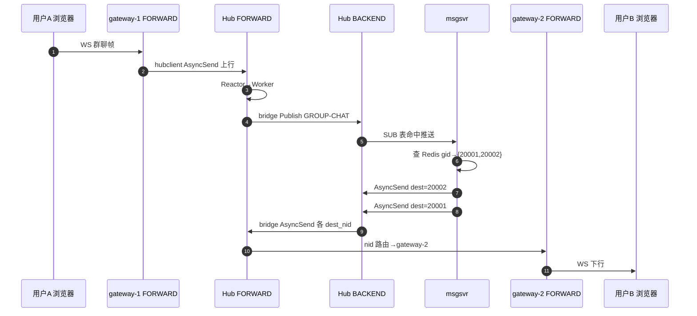
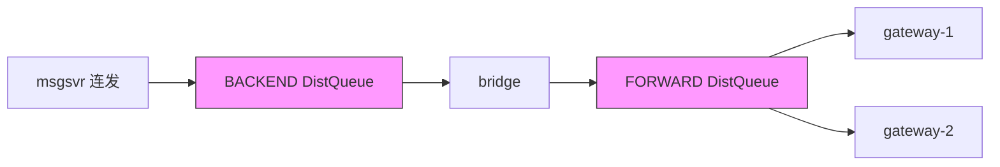

# 专题 6 — 群聊端到端背诵（hi-im + hi-im-core）

> **背诵目标**：一条跨 Gateway 群聊消息，从浏览器到浏览器 **30 秒讲完整**；并能挂上 Bug1/2/3 排查故事。

---

## 1. 部署拓扑（M6 Compose）

```text
gateway-1  NID=20001  ws :28080  ──┐
gateway-2  NID=20002  ws :28081  ──┼──► Hub FORWARD :28888
                                    │
msgsvr     NID=30001              ──┼──► Hub BACKEND  :28889
usrsvr / seqsvr / Redis / MySQL
```

用户 A（uid=100001）→ gateway-1；用户 B（uid=100002）→ gateway-2。

---

## 2. 全链路流程图（A 发群聊 → B 收到）



---

## 3. 分阶段背诵（每段一句）

| 步骤 | 谁 | 做什么 |
|------|-----|--------|
| 1 | 用户 A | WebSocket 发群聊，gateway 封装 IM 头 + body |
| 2 | gateway-1 | hubclient 连 **FORWARD**，`AsyncSend` 上行业务帧 |
| 3 | FORWARD | Reactor 拼帧 → RecvQueue → Worker |
| 4 | bridge | `peer->Publish(GROUP-CHAT)` 转到 **BACKEND** |
| 5 | msgsvr | 已在 BACKEND SUB 群聊 cmd，收到 publish |
| 6 | msgsvr | **第一段 fan-out**：Redis 查群成员 NID，循环 `AsyncSend` |
| 7 | BACKEND | 每成员一帧入 DistQueue → Distributor → gateway 对应连接 |
| 8 | bridge | **第二段**：`ReadDestNid` → `FORWARD AsyncSend` |
| 9 | gateway-2 | FORWARD 按 NID=20002 下行 → WS 推给 B |

---

## 4. 双段 fan-out 表（面试白板）

```text
┌─────────────────────────────────────────────────────────┐
│ 第一段 · 业务层（msgsvr @ BACKEND）                        │
│   gid=xxx → Redis → {nid_A, nid_B, ...}                  │
│   for nid in members: hubclient.AsyncSend(nid, payload)  │
├─────────────────────────────────────────────────────────┤
│ 第二段 · 总线层（bridge @ Hub）                            │
│   BACKEND 收到带 dest_nid 的 IM 头                         │
│   → FORWARD AsyncSend(dest_nid) → 各 gateway 接入 NID     │
└─────────────────────────────────────────────────────────┘
```

| 段 | 路由键 | 查什么表 |
|----|--------|----------|
| 第一段出口 | 成员 **用户 NID** | msgsvr 内存/Redis 群成员 |
| 第二段 | **gateway NID** | Hub Router `nid→连接` |

---

## 5. 跨 Gateway 为何容易踩 Bug（串联专题 3）

msgsvr 连发两帧（20001 + 20002）时：



| Bug | 触发点 | 症状 |
|-----|--------|------|
| **Bug2** | 两 Worker 并发 Push DistQueue（误 SPSC） | 偶发丢 B、重复 A |
| **Bug1** | bridge `ReadDestNid` 偏移错误 | dest 被读成 body length，路由到错 GW |
| **Bug3** | msgsvr sticky TCP 连 pop 多帧 | 第二帧污染第一帧 payload |

**排查顺序话术**：

1. msgsvr 日志 fan-out 全成功 → 排除业务层  
2. 开 `[bridge]` `[distributor]` `[reactor]` 日志看 dest_nid、seq  
3. 对照 IM 头 offset 24；查队列 MPSC 标注；跑 `bridge_downlink_test`

---

## 6. 与 Kafka 路径的区别（可选加分）

**热路径**（本专题）：msgsvr 同步 fan-out → Hub → gateway  

**削峰路径**（档 C 可选）：chatroom 写 Kafka → roomfanout 消费 → `AsyncSend` 进 BACKEND  

面试说：群聊冒烟走热路径；峰值聊天室可走 Kafka 旁路，**最终仍汇聚到 async_send**。

---

## 7. 30 秒口播稿（背这个）

> A 在 gateway-1 发群聊，帧进 Hub FORWARD，bridge 转 Publish 到 BACKEND，msgsvr 收到后查 Redis 得到 B 在 gateway-2，对 20002 调 AsyncSend；帧进 DistQueue，Distributor 投到 gateway-2 所在 Reactor 的 sendq，写出 TCP；bridge 在 BACKEND 侧把下行转给 FORWARD 的 AsyncSend，FORWARD 按 NID 表找到 gateway-2 连接，下行到 B。  
> 双平面意义是接入和业务 SUB 分离；双段 fan-out 是 msgsvr 按成员 NID 发一次、Hub 再按 gateway NID 路由一次。我们修过 DistQueue 的 MPSC 问题，否则多成员并发 AsyncSend 会丢包。

---

## 8. 验证命令（面试提到实操）

```bash
make m6-heal-down && make m6-heal

cd examples/smoke-group
HIIM_GATEWAY_A_WS=ws://127.0.0.1:28080/ws \
HIIM_GATEWAY_B_WS=ws://127.0.0.1:28081/ws \
go run . -burst 5
```

期望：**A→B、B→A 各 5 条全部到达**。

---

## 9. 文档与代码索引

| 内容 | 位置 |
|------|------|
| 档 C 群聊路径 | hi-im `doc/hi-im-档C技术方案设计.md` §11 |
| 三 Bug 合集 | hi-im `doc/系统问题收集/问题集合1.md` |
| 冒烟脚本 | hi-im `examples/smoke-group/main.go` |
| bridge 单测 | hi-im-core `test/bridge_downlink_test.cpp` |
| 本专题系列 | hi-im-core `doc/theme/01~05` |
