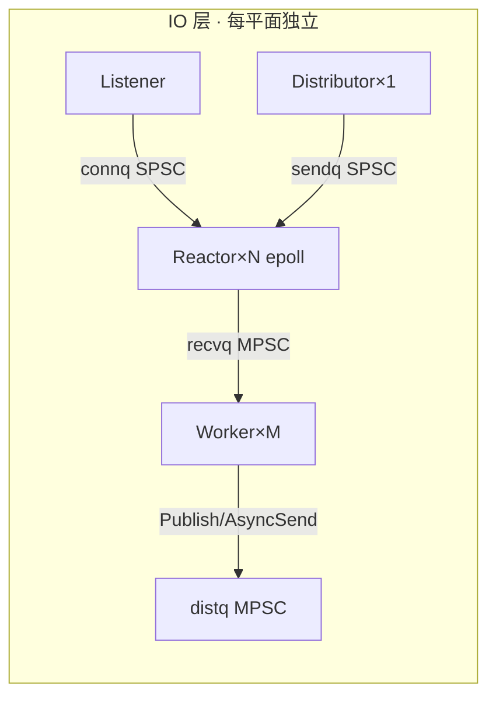
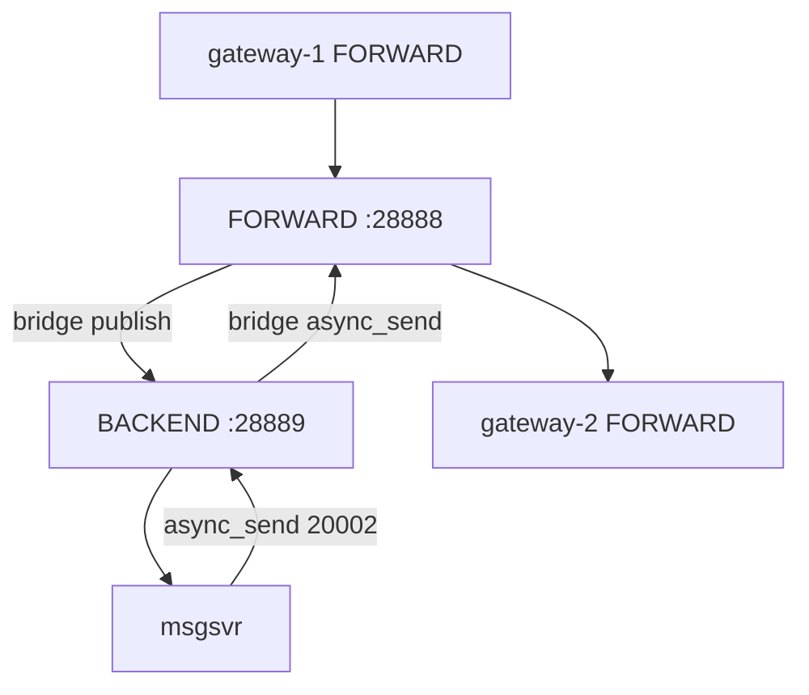

# 面试专题 — hi-im-core 核心机制背诵

> **用途**：结合 [hi-im](https://github.com/sunchao1/hi-im) 与 **hi-im-core** 源码，按专题整理面试可背诵要点。  
> **代码锚点**：`src/hub/reactor.cpp`、`queue.hpp`、`context_impl.cpp`、`bridge.cpp`、`distributor.cpp`  
> **关联**：[技术设计文档.md](../技术设计文档.md) §5、[hi-im 问题集合1](https://github.com/sunchao1/hi-im/blob/main/doc/系统问题收集/问题集合1.md)

---

## 阅读顺序（建议 30 分钟过一遍）

| 顺序 | 文档 | 面试一句话 |
|------|------|------------|
| 1 | [01-epoll-Reactor模型.md](01-epoll-Reactor模型.md) | Hub 用 **Reactor × N + epoll**，连接 stick 到固定线程，读写与拼帧在同线程完成 |
| 2 | [02-SPSC与MPSC队列语义.md](02-SPSC与MPSC队列语义.md) | Hub 四类队列必须按 **生产者数 × 消费者数** 选型，不能一刀切 SPSC |
| 3 | [03-Bug2-MPSC误用SPSC.md](03-Bug2-MPSC误用SPSC.md) | **架构设计对、实现错**：DistQueue/RecvQueue 多写单读却用了 SPSC，导致跨 Gateway 偶发丢包 |
| 4 | [04-双平面FORWARD与BACKEND.md](04-双平面FORWARD与BACKEND.md) | 单进程两套 HubContext，bridge 负责 **上行 publish / 下行 async_send** 跨平面转发 |
| 5 | [05-async_send与publish路由.md](05-async_send与publish路由.md) | **publish 按 cmd 广播 SUB 表**；**async_send 按 dest_nid 单播**；统一进 DistQueue 由 Distributor 单线程投 sendq |
| 6 | [06-群聊端到端背诵.md](06-群聊端到端背诵.md) | 跨 Gateway 群聊 **双段 fan-out** 全链路 + 三个 Bug 在面试里怎么讲 |

---

## 电梯演讲（60 秒版）

> hi-im-core 是 C++ 重写的必嗨 RTMQ Hub，单进程内跑 **FORWARD + BACKEND 双平面**，gateway 连 FORWARD、msgsvr 连 BACKEND，bridge 把上行转成 publish、下行转成 async_send。  
> IO 层是 **Listener → Reactor(epoll) → Worker → Distributor** 流水线；连接 stick 到 Reactor，业务在 Worker 处理，**Distributor 单线程**把 outbound 投到各 Reactor 的 sendq 写 TCP。  
> 线程间队列按语义分：**ConnQueue/SendQueue 是 SPSC**，**RecvQueue/DistQueue 是 MPSC**。我们曾把后两者误实现成 SPSC，多 Worker 并发入队时损坏槽位，表现为跨 Gateway 群聊偶发丢消息；改为 MpscQueue 后 burst 稳定 PASS。

---

## 白板必画（面试高频）

