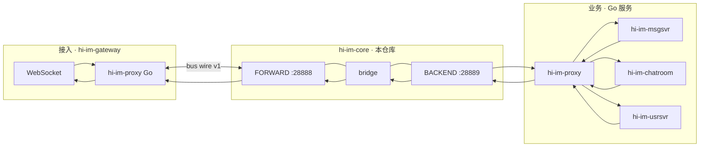

# hi-im-core 技术设计文档

> **组件**：hi-im-core（C++17/20）  
> **替代对象**：必嗨 RTMQ Server + frwder 双平面 Hub  
> **版本**：v0.1 · 2026-06-25  
> **许可证**：[Apache License 2.0](../LICENSE)

---

## 1. 背景与定位

### 1.1 是什么

**hi-im-core** 是 hi-im 生态中的 **进程间消息总线（Message Bus）**：

- **Hub（`hi-im-hub`）**：中心节点，维护 Proxy TCP 连接、SUB 订阅表、按 **cmd** 广播与按 **nid** 单播。
- **bridge**：Hub 内双平面桥接（FORWARD ↔ BACKEND），替代必嗨 `frwd_mesg.c`。
- **C++ Proxy SDK**（可选）：嵌入 C++ 接入进程；Go 业务优先用独立仓库 **hi-im-proxy**。

与 Kafka / gRPC 的分工：

| 组件 | 职责 |
|------|------|
| **hi-im-core** | IM **热路径**：毫秒级、内存转发、不持久化 |
| **Kafka** | 削峰、持久、有序日志（chatroom 峰值旁路，由 hi-im-roomfanout 消费后再进 Hub） |
| **gRPC** | **冷路径**：seqsvr 发号、Hub 控制面（Phase 2） |

### 1.2 设计目标

| 维度 | 指标 |
|------|------|
| **协议兼容** | **bus wire v1** 与必嗨 RTMQ **二进制兼容**（20 字节头 + payload） |
| **性能** | `hi-im-bench` publish 模式 **≥ 14 万 msg/s**（256B 小包、单机、无持久化） |
| **扩展** | Hub **按 NID 范围分片**（Phase 2）；接入层 Proxy 水平扩展 |
| **工程** | C++17/20、RAII、单元测试、Prometheus、结构化日志 |
| **净室** | 不拷贝必嗨 C 源码；对照协议与行为重写 |

### 1.3 非目标（Non-Goals）

- 不理解 IM 语义（群、好友、会话）；只认 **cmd/type** 与 **nid**。
- 不持久化消息、不提供消费位点、不替代 Kafka。
- 不持有客户端 WebSocket；长连接由 **hi-im-gateway** 负责。
- 第一期不包含 listend（TCP 接入）重写。

---

## 2. 在 hi-im 中的位置



**一条群聊消息的进程间路径**（与必嗨一致）：

```text
浏览器 → gateway(NID=20001) → [FORWARD] → publish(GROUP-CHAT) → msgsvr
msgsvr 查 Redis gid→nid → async_send(nid=20002) → [BACKEND→FORWARD] → gateway(20002) → 浏览器
```

---

## 3. 进程与双平面模型

### 3.1 单 Hub 进程 = 两个 Server 实例

与必嗨 frwder 相同，**一个 `hi-im-hub` 进程内运行两套独立 Hub 上下文**：

| 平面 | 默认端口 | 连接方 | 典型流向 |
|------|----------|--------|----------|
| **FORWARD** | 28888 | gateway、listend（Proxy） | 上行入口、下行出口 |
| **BACKEND** | 28889 | msgsvr、chatroom、usrsvr、roomfanout | 上行出口、下行入口 |

### 3.2 bridge 规则

```text
FORWARD 收到 Proxy 上行业务帧  →  publish(BACKEND, cmd, payload)
BACKEND 收到 Proxy 下行业务帧  →  async_send(FORWARD, cmd, dest_nid, payload)
                                      dest_nid 取自 IM MesgHeader.nid（bridge 不解析 PB，只读 IM 头）
```

bridge 是 **Hub Server 侧 worker 注册的默认 handler**，不是独立进程。

### 3.3 核心 API（语义）

| API | 路由键 | 语义 |
|-----|--------|------|
| **publish(ctx, type, data)** | **cmd/type** | 查 SUB 表，向所有订阅该 type 的 Proxy 连接推送 |
| **async_send(ctx, type, dest_nid, data)** | **dest_nid** | 查 nid→连接映射，单播到指定接入 NID |

Proxy 侧对外主要是 **AsyncSend**（上行交给 Hub，由 Hub/bridge 决定 publish 或再 async_send）。

---

## 4. 核心概念

| 字段 | 含义 | 约束 |
|------|------|------|
| **NID** | Node ID，进程实例唯一标识 | Proxy 配置；AUTH 后绑定 TCP |
| **GID** | Group ID，机房/运营商分组 | SUB 表按 GID 分组；publish 可按组 fan-out |
| **SID** | Session ID，连接会话 | accept 递增，SUB 去重 |
| **cmd / type** | 业务命令字 | 与 hi-im-api 中 `CMD_*` 一致（如 `0x030B` GROUP-CHAT） |

**flag 区分**：

| flag | 含义 |
|------|------|
| `HIIM_SYS_MESG (0)` | 系统命令（AUTH、SUB、KPALIVE…） |
| `HIIM_EXP_MESG (1)` | 业务消息（cmd = IM 命令） |

---

## 5. 线程与 IO 模型

### 5.1 模块对照（必嗨 → hi-im-core）

| 必嗨 RTMQ | hi-im-core | 职责 |
|-----------|------------|------|
| rtmq_lsn | `Listener` | accept → connq |
| rtmq_rsvr | `Reactor` × N | epoll/uring 收发包、snap 拼帧、AUTH/SUB |
| rtmq_dist | `Distributor` × 1 | async_send 入口 → 按 nid 投 sendq |
| rtmq_worker | `Worker` × M | recvq 消费、bridge 回调 |
| rtmq_proxy_tsvr | `ProxyTransport` | Proxy 连 Hub、writev 发送 |
| rtmq_proxy_worker | `ProxyWorker` | Proxy 收下行、调 handler |

### 5.2 数据流

```text
┌─────────────┐
│ Listener ×1 │  accept → connq[i] → 唤醒 Reactor[i]
└─────────────┘

┌─────────────┐     recvq        ┌─────────────┐
│ Reactor × N │ ───────────────► │ Worker × M  │ → bridge / reg(cmd)
│ 读写 TCP    │ ◄── sendq        └─────────────┘
└─────────────┘

┌─────────────┐     distq
│ Distributor │ ──pop──► sendq[reactor_idx] ──► Reactor 写 TCP
└─────────────┘
```

**设计要点**（继承必嗨，C++ 实现优化）：

1. **连接 stick 到 Reactor**：同 TCP 固定在同一线程，减少锁。
2. **Distributor 单线程**：统一消费 async_send 队列，避免多写 sendq 竞态。
3. **eventfd / pipe 唤醒**：队列非空即唤醒，避免忙等。
4. **snap 拼帧缓冲**：`std::vector<uint8_t>` + RAII，替代 C 手动 realloc。

### 5.3 档 C IO 升级

| 项 | Phase 1 | Phase 2 |
|----|---------|---------|
| IO 多路复用 | **epoll** | 可选 **io_uring**（`-DHIIM_USE_URING=ON`） |
| 线程间队列 | 有界 SPSC 环 | 同左 + 内存池 |
| 发送 | writev 批量 | coalesce 小包 |
| listen | 单线程 accept | 可选 SO_REUSEPORT 多 Listener |

---

## 6. 路由算法

### 6.1 publish

```text
publish(type, data):
  1. sub_table.find(type)           // 无订阅返回 NotFound
  2. for each subscriber (gid, sid, nid):
       async_send(type, nid, data)   // 展开为多次单播
```

### 6.2 async_send

```text
async_send(type, dest_nid, data):
  1. 组装 bus wire 帧（nid = dest_nid, flag = EXP_MESG）
  2. dist_queue.push(frame)
  3. 唤醒 Distributor

Distributor:
  4. idx = nid_to_reactor_map(dest_nid)
  5. send_queue[idx].push(frame)
  6. 唤醒 Reactor[idx] → writev TCP
```

### 6.3 SUB

Proxy AUTH 成功后，对需 **接收** 的每个 cmd 发送 `SUB_REQ`。Hub 在内存表记录：

```text
type (cmd) → [ (gid, sid, nid), ... ]
```

**注意**：publish 默认 **广播给所有 SUB 者**；msgsvr 多副本会重复消费，需业务层单 SUB 或 Kafka 分片（见 §9）。

---

## 7. Hub 分片（Phase 2）

### 7.1 问题

K8s 对 Hub 做 `replicas++` + Service LB → NID 注册在 Pod-A，`async_send(nid)` 打到 Pod-B → **丢包**。

### 7.2 方案：按接入 NID 范围分片

```text
Shard-0: NID ∈ [20001, 20100]  →  hi-im-hub-0
Shard-1: NID ∈ [20101, 20200]  →  hi-im-hub-1
```

| 角色 | 规则 |
|------|------|
| gateway | `--shard-id=0 --nid=20001`，只连本 Shard FORWARD |
| 业务 Proxy | 连任意 Shard BACKEND（或配置 multi-backend） |
| 跨 Shard nid | owner Shard 转发（Hub 间内部 TCP 或 gRPC 控制面，Phase 2） |

Phase 1 **只做单 Shard**，bench 与群聊冒烟通过后再做 M6 分片。

---

## 8. 对外 API

### 8.1 C++ 命名空间 `hiim::`

**Hub Server（bridge 内部）**：

```cpp
namespace hiim {

class HubContext;

Status Publish(HubContext& ctx, uint32_t cmd,
               const uint8_t* data, size_t len);

Status AsyncSend(HubContext& ctx, uint32_t cmd, uint32_t dest_nid,
                 const uint8_t* data, size_t len);

}  // namespace hiim
```

**Proxy SDK**（嵌入 C++ 进程，Go 侧用 hi-im-proxy）：

```cpp
class Proxy {
 public:
  Status Start(const ProxyOptions& opts);
  Status AsyncSend(uint32_t cmd, uint32_t dest_nid,
                   const uint8_t* data, size_t len);
  void RegisterHandler(uint32_t cmd, MessageHandler handler);
  void Stop();
};
```

### 8.2 与 hi-im-proxy 的契约

- 线协议：**bus wire v1** 完全一致（见 [协议规范-bus-wire-v1.md](协议规范-bus-wire-v1.md)）。
- Go 服务 **不 CGO 链接** hi-im-core；只通过 TCP 连 `hi-im-hub`。
- 认证：AUTH 用户名/密码 + gid + nid，与必嗨配置字段对齐。

### 8.3 配置项

**命令行 / 环境变量**（`hi-im-hub`）：

| 项 | 默认 | 说明 |
|----|------|------|
| `--forward-listen` | `0.0.0.0:28888` | FORWARD 平面 |
| `--backend-listen` | `0.0.0.0:28889` | BACKEND 平面 |
| `--reactor-threads` | 4 | Reactor 数量 |
| `--worker-threads` | 4 | Worker 数量 |
| `--shard-id` | 0 | 分片 ID（Phase 2） |
| `--nid-min` / `--nid-max` | — | 本 Shard 负责的 NID 范围 |
| `--metrics-listen` | `0.0.0.0:9090` | Prometheus |

**Proxy 侧（hi-im-proxy，文档仅供参考）**：

```bash
HIIM_FORWARD_ADDR=127.0.0.1:28888
HIIM_BACKEND_ADDR=127.0.0.1:28889
HIIM_NID=20001
HIIM_AUTH_USER=websocket
HIIM_AUTH_PASS=***
```

---

## 9. 与业务层的边界

| 层 | 做什么 | 不做什么 |
|----|--------|----------|
| **hi-im-core** | publish / async_send / SUB / TCP | room 路由、iplist、持久化 |
| **bridge** | 双平面转发 | 解析 Protobuf |
| **hi-im-gateway** | WS、ChatTab 第二段 fan-out | 替代 Hub |
| **msgsvr / chatroom** | Redis gid/rid→nid，第一段 fan-out | 持有 Hub 连接表 |
| **Kafka + roomfanout** | 削峰 | 替代最后一跳 async_send |

**SUB 策略建议**（业务配置，非 core 强制）：

| cmd | 建议 |
|-----|------|
| GROUP-CHAT / ROOM-CHAT | 单实例 SUB，或 Kafka 分片后 0 SUB |
| ONLINE 等 | 单活或按 shard |

---

## 10. 可观测

### 10.1 Prometheus 指标

| 指标 | 类型 | 说明 |
|------|------|------|
| `hiim_connections` | gauge | 按 plane、shard 的连接数 |
| `hiim_subscriptions` | gauge | 按 cmd 的 SUB 数 |
| `hiim_publish_total` | counter | publish 次数 |
| `hiim_async_send_total` | counter | async_send 次数 |
| `hiim_queue_depth` | gauge | dist/send/recv 队列深度 |
| `hiim_drop_total` | counter | 背压丢弃 |
| `hiim_forward_latency_us` | histogram | 转发耗时 |

### 10.2 日志

- **spdlog**，JSON 可选。
- 关键事件：AUTH 失败、SUB、连接断开、队列满丢弃、拼帧错误。

### 10.3 健康检查

- `GET /healthz`：Listener 正常、Distributor 线程存活。
- `GET /readyz`：双平面均已 listen。

---

## 11. 代码目录结构

```text
hi-im-core/
├── CMakeLists.txt
├── LICENSE
├── NOTICE
├── README.md
├── doc/                          # 本目录
├── include/hiim/
│   ├── wire/header.hpp
│   ├── wire/sys_cmd.hpp
│   ├── hub/context.hpp
│   ├── hub/bridge.hpp
│   └── proxy/proxy.hpp
├── src/
│   ├── wire/
│   ├── hub/
│   │   ├── listener.cpp
│   │   ├── reactor.cpp
│   │   ├── distributor.cpp
│   │   ├── worker.cpp
│   │   ├── router.cpp            # SUB + nid map
│   │   └── bridge.cpp
│   └── proxy/
├── cmd/
│   ├── hi-im-hub/main.cpp
│   └── hi-im-bench/main.cpp
├── test/
│   ├── wire_header_test.cpp
│   ├── router_test.cpp
│   └── integration/hub_proxy_test.cpp
└── deploy/
    └── docker/Dockerfile.hub
```

### 11.1 构建要求

- **C++17** 起（建议 C++20）
- **CMake ≥ 3.16**
- Linux（开发与生产）；macOS 仅便于编辑，bench 以 Linux 为准
- 依赖：pthread；可选 liburing、prometheus-cpp、spdlog（可用 FetchContent）

---

## 12. 测试与验收

### 12.1 单元测试

| 模块 | 用例 |
|------|------|
| wire | 20B 头编解码、字节序、chksum、帧边界 |
| router | SUB 增删、publish 展开、nid 查表 |
| snap | 半包/粘包拼帧 |

### 12.2 集成测试

- 启动 `hi-im-hub` + 模拟 Proxy（或 hi-im-proxy）：
  - AUTH → SUB → AsyncSend → 对端 handler 收到
  - FORWARD 上行 → bridge → BACKEND publish → 业务 handler

### 12.3 压测验收（M1 必须）

对齐必嗨 `tools/rtmq-bench`：

```bash
# publish 模式，10s，256B
./hi-im-bench -mode publish -duration 10s -payload 256
# 验收：recv/s ≥ 140000（单机、与必嗨同口径）
```

输出 JSON 基线文件 `bench/baseline-v1.json` 入库。

---

## 13. 实施里程碑（本仓库）

| 阶段 | 内容 | 工期 | 验收 |
|------|------|------|------|
| **M1a** | wire v1 + 单测 | 1 周 | 与 `rtmq_mesg.h` 二进制一致 |
| **M1b** | Hub 单 Shard（epoll）+ bridge | 2 周 | 集成测试通过 |
| **M1c** | hi-im-bench ≥ 14 万/s | 3 天 | baseline JSON |
| **M2** | Prometheus + 配置化 | 1 周 | /metrics 可用 |
| **M3** | io_uring 可选 + SPSC 队列 | 1 周 | bench 不低于 epoll 版 |
| **M4** | Hub 分片 + 跨 shard 转发 | 3 周 | 2 shard 压测 |

---

## 14. 风险与决策

| ID | 决策 | 理由 |
|----|------|------|
| C1 | bus wire v1 兼容 RTMQ | 可对照必嗨文档与 pcap，降低迁移风险 |
| C2 | Go Proxy 独立仓库 | 避免 CGO；core 只提供 C++ SDK 可选 |
| C3 | 双平面同进程 | 与必嗨 frwder 行为一致，bridge 零拷贝 |
| C4 | Distributor 单线程 | 继承必嗨验证过的并发模型 |
| C5 | Phase 1 单 Shard | 分片复杂度后置 |
| C6 | Apache 2.0 | 与 hi-im 生态一致 |

| 风险 | 缓解 |
|------|------|
| 拼帧 bug | wire 单测 + 必嗨抓包对照 |
| 性能回退 | 每 PR 跑 bench 对比 baseline |
| 跨 shard 复杂 | M4 前文档先写清 nid 归属规则 |

---

## 15. 参考

- 必嗨 RTMQ 设计（只读对照）：beehive-im `doc/rtmq/RTMQ-技术设计文档.md`
- hi-im 生态总览：beehive-im `doc/hi-im-档C技术方案设计.md`
- 线协议细节：[协议规范-bus-wire-v1.md](协议规范-bus-wire-v1.md)
- M1 任务：[M1-实施清单.md](M1-实施清单.md)

---

*文档版本：2026-06-25 · hi-im-core 净室实现，不包含必嗨 C 源码。*
